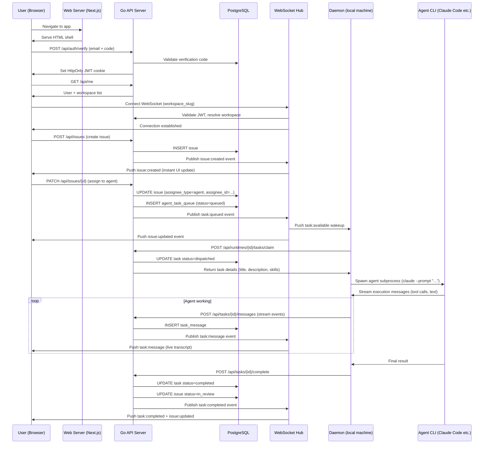

# Architecture Overview

## What Is Multica?

Multica is an AI-native project management platform — think Linear or Jira, but with AI coding agents as first-class team members. Agents can be assigned issues (tasks), execute them autonomously using real coding tools, comment on issues, change statuses, and report progress — all within the same interface that human team members use.

The key insight of the product: agents are not a bolt-on. The entire data model, permission system, real-time event layer, and CLI tooling are built to treat an AI agent and a human developer as equivalent actors.

---

## Major Components

```
┌─────────────────────────────────────────────────────────────────────┐
│                         Client Tier                                 │
│                                                                     │
│   ┌──────────────────┐          ┌──────────────────────────┐        │
│   │  apps/web        │          │  apps/desktop            │        │
│   │  (Next.js 15     │          │  (Electron + electron-   │        │
│   │   App Router)    │          │   vite)                  │        │
│   └────────┬─────────┘          └────────────┬─────────────┘        │
│            │                                 │                      │
│            └──────────┬──────────────────────┘                      │
│                       │  shared business logic                      │
│            ┌──────────▼────────────────────────┐                    │
│            │  packages/views  (shared pages)   │                    │
│            │  packages/core   (stores, API)    │                    │
│            │  packages/ui     (atoms)          │                    │
│            └──────────┬────────────────────────┘                    │
└───────────────────────│─────────────────────────────────────────────┘
                        │  HTTPS REST + WebSocket
┌───────────────────────▼─────────────────────────────────────────────┐
│                         Server Tier                                 │
│                                                                     │
│   ┌─────────────────────────────────────────────────┐               │
│   │  Go HTTP Server (Chi router, port 8080)         │               │
│   │                                                 │               │
│   │  ┌──────────┐  ┌──────────┐  ┌──────────────┐  │               │
│   │  │ Handlers │  │ Services │  │ Realtime Hub │  │               │
│   │  │ (REST)   │  │ (task,   │  │ (WebSocket   │  │               │
│   │  │          │  │  autopil)│  │  broadcast)  │  │               │
│   │  └────┬─────┘  └────┬─────┘  └──────┬───────┘  │               │
│   │       │             │               │           │               │
│   │  ┌────▼─────────────▼───────────────▼───────┐  │               │
│   │  │          Events Bus (in-process)          │  │               │
│   │  └─────────────────────┬─────────────────────┘  │               │
│   └────────────────────────│────────────────────────┘               │
│                            │  optional                              │
│   ┌────────────────────────▼────────────────────────┐               │
│   │  Redis (optional — enables multi-node fanout)   │               │
│   └─────────────────────────────────────────────────┘               │
│                                                                     │
│   ┌─────────────────────────────────────────────────┐               │
│   │  PostgreSQL 17 + pgvector                       │               │
│   │  (sqlc-generated queries, pgcrypto, pg_cron)    │               │
│   └─────────────────────────────────────────────────┘               │
└─────────────────────────────────────────────────────────────────────┘
                        │  WebSocket (daemon protocol)
┌───────────────────────▼─────────────────────────────────────────────┐
│                      Agent Tier (user's machine)                    │
│                                                                     │
│   ┌───────────────────────────────────────────────┐                 │
│   │  mato daemon (Go binary)                   │                 │
│   │                                               │                 │
│   │  ┌──────────────┐   Spawns subprocess         │                 │
│   │  │ Task Poller  │──────────────────►  Claude Code CLI           │
│   │  │              │                   Codex CLI                   │
│   │  │              │                   Cursor / Gemini / etc.      │
│   │  └──────────────┘                             │                 │
│   └───────────────────────────────────────────────┘                 │
└─────────────────────────────────────────────────────────────────────┘
```

---

## How the Three Tiers Fit Together

### 1. The Server (Go, port 8080)

The Go server is the single source of truth. It owns:

- **REST API** for all CRUD operations (issues, agents, comments, etc.)
- **WebSocket hub** for pushing real-time events to browsers and the desktop app
- **Daemon WebSocket hub** — a separate WebSocket endpoint exclusively for local agent daemons
- **Task queue** — a PostgreSQL-backed work queue that tracks which agent is working on which issue
- **Event bus** — an in-process publish/subscribe system; every mutation publishes an event that the realtime layer converts to WebSocket broadcasts

### 2. The Frontend (Next.js + Electron)

Both the web app and the desktop app share the vast majority of their code through shared packages:

- **`packages/core/`** — all business logic: API client, Zustand stores, query hooks (TanStack Query)
- **`packages/views/`** — all shared UI pages and components
- **`packages/ui/`** — atomic design-system components (buttons, inputs, etc.)

The web app (`apps/web/`) adds only Next.js-specific wiring (cookies, server-side routes). The desktop app (`apps/desktop/`) adds only Electron-specific wiring (window management, tab system, local file access).

### 3. The Daemon (local agent runtime)

The daemon is a separate Go binary (`mato daemon`) that runs on a developer's local machine (or a CI server). Its job:

1. Connect to the server via WebSocket
2. Register available agent runtimes (Claude Code, Codex, Cursor, etc.)
3. Poll for tasks assigned to those runtimes
4. Spawn the actual agent CLI as a subprocess
5. Stream progress back to the server in real time

---

## Full Login-to-Task-Complete Journey

Here is what happens from the moment a user logs in to the moment an agent completes a task:



---

## Key Architectural Decisions and Trade-offs

### No Polling — Everything is Event-Driven

The UI never polls the server. Every data change (issue update, task progress, agent status change) is pushed via WebSocket. TanStack Query manages the client-side cache; WebSocket events trigger cache invalidations, not direct cache writes. This keeps the cache as the single source of truth and avoids race conditions.

### Redis is Optional

In single-node mode (no `REDIS_URL`), events are broadcast in-memory within the single Go process. Add Redis and the server can scale horizontally — Redis Streams fan out events across multiple API nodes. The architecture supports three relay modes: `legacy` (single pub/sub channel), `sharded` (partitioned Redis Streams, the default), and `dual` (both simultaneously for zero-downtime migration).

### Agents Are Treated Like Members

Throughout the data model, anywhere a `member` can be an actor (create an issue, post a comment, change status), an `agent` can too. The `creator_type` / `creator_id` and `author_type` / `author_id` pattern appears on `issue`, `comment`, and `activity_log`. This isn't bolted on — it's the original schema.

### Skills Are Markdown Files, Not Vector Embeddings

Despite the presence of pgvector in the stack, skills are **not** retrieved by vector similarity in the current version. A skill is a named markdown document (SKILL.md content) attached to an agent. When the daemon launches an agent, it materializes the skill files into the agent's working directory. pgvector appears in the migration history but is not currently used for semantic skill retrieval. **This is a significant feature gap if you plan to build a knowledge-retrieval product on top.**

### The Daemon Is a Trust Boundary

The daemon authenticates to the server using a long-lived daemon token (`mdt_...`). Once authenticated, it can claim tasks, report progress, and complete tasks — but only for runtimes it owns. The server verifies every daemon API call against the token's workspace before allowing any write. Agents (the AI) authenticate with both `X-Agent-ID` and `X-Task-ID` headers and are only trusted if the task belongs to the claimed agent.

### Skills Have No pgvector Search

The `skill` table has no vector column. The `pgvector` extension is enabled in the schema but not yet used for semantic search. Skill retrieval is by exact name match or full list scan. This is important to know before building a "smart skill recommendation" feature.

---

## Technology Stack Summary

| Layer | Technology |
|-------|-----------|
| Backend language | Go 1.26 |
| HTTP router | Chi v5 |
| Database | PostgreSQL 17 + pgvector + pgcrypto + pg_cron |
| DB query layer | sqlc (generates type-safe Go from SQL) |
| Real-time | gorilla/websocket + in-process event bus + optional Redis Streams |
| Frontend framework | Next.js 15 (App Router) |
| Desktop shell | Electron via electron-vite |
| State management | TanStack Query (server state) + Zustand (client state) |
| Build system | Turborepo + pnpm workspaces |
| Auth | Email magic-link (verification code) + JWT (HttpOnly cookie) + PAT |
| File storage | AWS S3 / CloudFront (optional) or local |
| Analytics | Pluggable client (noop by default) |
| Metrics | Prometheus-compatible endpoint (optional) |
| Email | Resend API or SMTP |
| Agent CLIs | Claude Code, Codex, Cursor, Copilot, Gemini, Kimi, Kiro, OpenCode, OpenClaw, Hermes, Pi |
