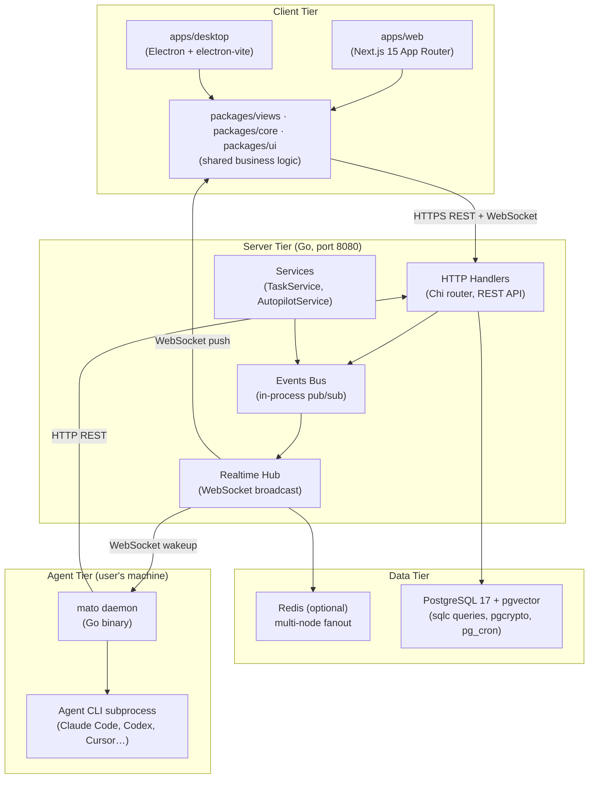
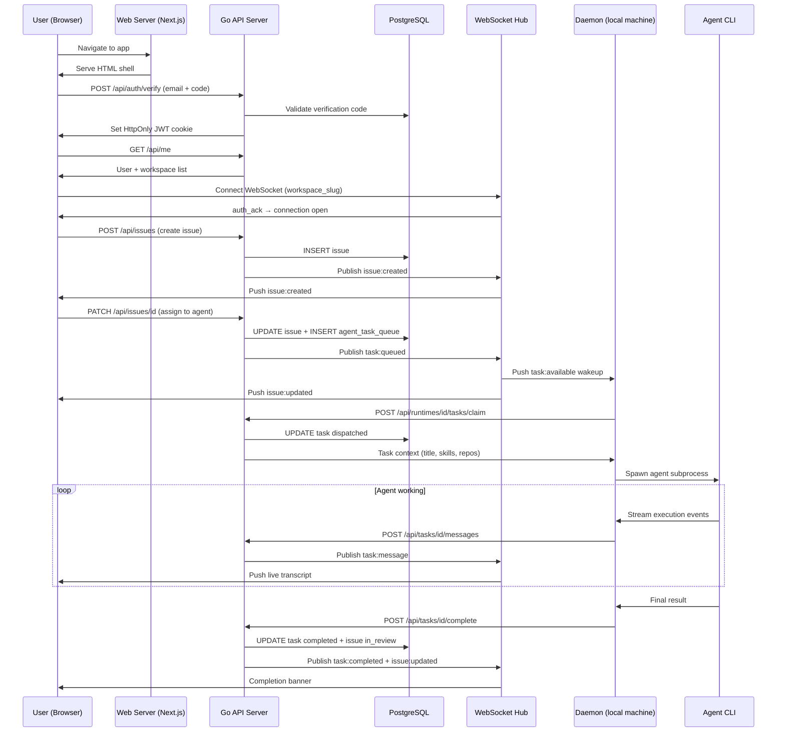

# Architecture Overview

## What Is Multica?

Multica is an AI-native project management platform — think Linear or Jira, but with AI coding agents as first-class team members. Agents can be assigned issues (tasks), execute them autonomously using real coding tools, comment on issues, change statuses, and report progress — all within the same interface that human team members use.

The key insight of the product: **agents are not a bolt-on**. The entire data model, permission system, real-time event layer, and CLI tooling are built to treat an AI agent and a human developer as equivalent actors.

---

## Major Components

---

## How the Three Tiers Fit Together

### 1. The Server (Go, port 8080)

The Go server is the single source of truth. It owns:

- **REST API** for all CRUD operations (issues, agents, comments, etc.)
- **WebSocket hub** for pushing real-time events to browsers and the desktop app
- **Daemon WebSocket hub** — a separate WebSocket endpoint exclusively for local agent daemons
- **Task queue** — a PostgreSQL-backed work queue tracking which agent works on which issue
- **Event bus** — an in-process pub/sub system; every mutation publishes an event that the realtime layer converts to WebSocket broadcasts

### 2. The Frontend (Next.js + Electron)

Both apps share the vast majority of their code through shared packages:

| Package | Purpose |
|---------|---------|
| `packages/core/` | All business logic: API client, Zustand stores, query hooks |
| `packages/views/` | All shared UI pages and components |
| `packages/ui/` | Atomic design-system components |

The web app (`apps/web/`) adds only Next.js-specific wiring. The desktop app (`apps/desktop/`) adds only Electron-specific wiring.

### 3. The Daemon (local agent runtime)

The daemon is a separate Go binary (`mato daemon`) that runs on a developer's local machine (or a CI server). Its job:

1. Connect to the server via WebSocket
2. Register available agent runtimes (Claude Code, Codex, Cursor, etc.)
3. Poll for tasks assigned to those runtimes
4. Spawn the actual agent CLI as a subprocess
5. Stream progress back to the server in real time

---

## Full Login-to-Task-Complete Journey

---

## Key Architectural Decisions

> [!TIP] No Polling — Everything is Event-Driven
> The UI never polls the server. Every data change is pushed via WebSocket. TanStack Query manages the client-side cache; WebSocket events trigger cache invalidations, not direct cache writes.

> [!NOTE] Redis is Optional
> In single-node mode (no `REDIS_URL`), events are broadcast in-memory. Add Redis and the server scales horizontally via Redis Streams. Three relay modes: `sharded` (default), `legacy`, `dual` (migration tool).

> [!IMPORTANT] Agents Are Treated Like Members
> Throughout the data model, anywhere a `member` can be an actor, an `agent` can too. The `creator_type` / `creator_id` and `author_type` / `author_id` pattern appears on `issue`, `comment`, and `activity_log`. This is the original schema design.

> [!WARNING] Skills Use No pgvector Today
> Despite pgvector being installed, skills are **not** retrieved by vector similarity. A skill is a named markdown document attached to an agent. pgvector is present but has no vector columns in the schema. This is a significant gap if you plan to build knowledge-retrieval features.

> [!CAUTION] The Daemon Is a Trust Boundary
> Daemon tokens (`mdt_...`) are workspace-scoped and long-lived. Agents authenticate with both `X-Agent-ID` and `X-Task-ID` — `X-Agent-ID` alone is rejected (impersonation prevention, PR #2359).

---

## Technology Stack Summary

| Layer | Technology |
|-------|-----------|
| Backend language | Go 1.26 |
| HTTP router | Chi v5 |
| Database | PostgreSQL 17 + pgvector + pgcrypto + pg_cron |
| DB query layer | sqlc (type-safe Go from SQL) |
| Real-time | gorilla/websocket + event bus + optional Redis Streams |
| Frontend framework | Next.js 15 (App Router) |
| Desktop shell | Electron via electron-vite |
| State management | TanStack Query (server state) + Zustand (client state) |
| Build system | Turborepo + pnpm workspaces |
| Auth | Email magic-link + JWT (HttpOnly cookie) + PAT |
| File storage | AWS S3 / CloudFront (optional) or local |
| Agent CLIs | Claude Code, Codex, Cursor, Copilot, Gemini, Kimi, Kiro, OpenCode, OpenClaw, Hermes, Pi |

---

## Related Documents

- [[data-flow]] — Full task lifecycle data flow
- [[backend/01-handler-layer]] — HTTP API handler details
- [[backend/02-websocket-realtime]] — WebSocket and real-time system
- [[backend/03-agent-lifecycle]] — Agent lifecycle management
- [[integrations]] — External integrations and adding new agent providers
- [[what-to-change-for-saas]] — SaaS migration guide
- [[glossary]] — All key terms defined
