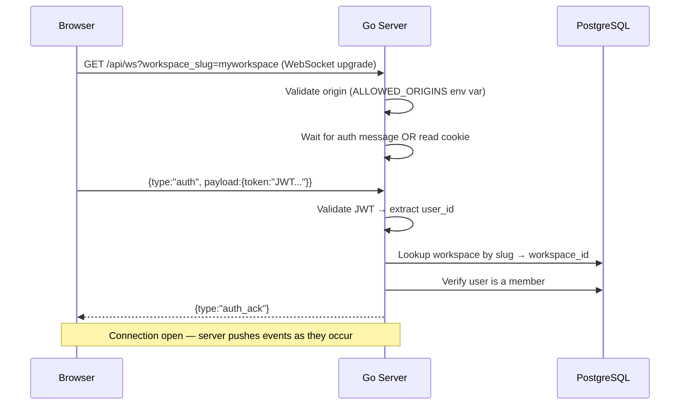
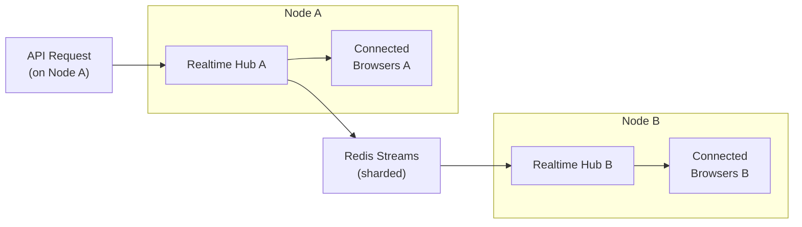

# Backend: WebSocket and Real-Time Updates

## Two WebSocket Subsystems

> [!IMPORTANT] Do Not Confuse These Two
> MATO has **two completely separate** WebSocket subsystems with different endpoints, auth, and protocols:
> 1. **Realtime Hub** — pushes events to **browsers** and the desktop app (`/api/ws`)
> 2. **Daemon Hub** — communicates with **local agent daemons** (`/api/daemon/ws`)

---

## The Realtime Hub (Browser-Facing)

### Purpose

Every time data changes in the database, the browser needs to know immediately. No polling — pure push.

### Connection Flow



> [!NOTE] Cookie Auth (Browser)
> In cookie mode, the JWT is sent automatically with the WebSocket upgrade request. No auth message needed — server responds with `auth_ack` immediately. The token is **never** sent as a URL query parameter (would be logged by proxies/CDNs).

### Scope Subscriptions

After connecting, clients can subscribe to specific resources:

```javascript
// Subscribe to a specific task's execution messages
ws.send(JSON.stringify({
  type: "subscribe",
  payload: { scope_type: "task", scope_id: "<task_uuid>" }
}))

// Subscribe to a specific chat session
ws.send(JSON.stringify({
  type: "subscribe",
  payload: { scope_type: "chat_session", scope_id: "<session_uuid>" }
}))
```

The `ScopeAuthorizer` interface validates that the resource belongs to the user's workspace. Positive results are cached to avoid hot-path DB load.

### Complete Event Type Reference

| Event Type | When It Fires | Payload Contains |
|-----------|--------------|-----------------|
| `issue:created` | New issue | Full issue object |
| `issue:updated` | Issue fields changed | Updated issue |
| `issue:deleted` | Issue deleted | `{ id }` |
| `comment:created` | New comment | Full comment |
| `comment:updated` | Comment edited | Updated comment |
| `comment:deleted` | Comment deleted | `{ id }` |
| `comment:resolved` | Thread resolved | Updated comment |
| `task:queued` | Task added to queue | Task object |
| `task:dispatch` | Task started by daemon | Task object |
| `task:progress` | Agent progress update | `{ task_id, summary, step, total }` |
| `task:message` | Single agent execution event | `{ task_id, seq, type, tool, content, ... }` |
| `task:completed` | Agent finished | Task + result |
| `task:failed` | Agent failed | Task + error |
| `task:cancelled` | Task cancelled | Task object |
| `agent:status` | Agent status changed | Agent object |
| `agent:created` | New agent | Agent object |
| `agent:archived` | Agent archived | `{ id }` |
| `daemon:heartbeat` | Runtime heartbeat | `{ runtime_id, status }` |
| `skill:created/updated/deleted` | Skill changes | Skill object or `{ id }` |
| `chat:message` | New chat message | Message object |
| `chat:done` | Agent finished responding | Full assistant message |
| `workspace:updated` | Workspace settings changed | Workspace object |
| `member:added/updated/removed` | Membership changes | Member object |
| `inbox:new` | New notification | Inbox item |
| `project:created/updated/deleted` | Project changes | Project object |
| `squad:created/updated/deleted` | Squad changes | Squad object |
| `github_installation:created/deleted` | GitHub integration | Installation object |
| `pull_request:linked/updated/unlinked` | PR changes | PR object |

---

## Multi-Node Scaling with Redis



Three relay modes:

| Mode | Description | Use Case |
|------|-------------|----------|
| `sharded` | Multiple Redis stream shards, deterministic write by workspace | **Default** — best performance |
| `legacy` | Single Redis pub/sub channel | Old mode; simpler but bottlenecked |
| `dual` | Both sharded + legacy simultaneously | Zero-downtime migration only |

> [!CAUTION] Shard Count Lock-In
> Once deployed, changing `REALTIME_RELAY_SHARDS` requires draining all stream consumers. Events are written to a shard deterministically by workspace ID (preserving per-workspace ordering). Changing the shard count changes the mapping — plan carefully.

> [!NOTE] Redis Relay Is Required for Horizontal Scaling
> Without `REDIS_URL`, events only reach clients on the same node that processed the request. For multi-tenant SaaS behind a load balancer, Redis is mandatory. See [[what-to-change-for-saas]] for details.

---

## The Daemon Hub (Agent-Facing)

### Purpose

A completely separate WebSocket endpoint (`/api/daemon/ws`) used exclusively by the daemon binary:

1. **Wakeup notifications** — server pushes `task:available` instead of waiting for the daemon to poll
2. **Daemon registration** — daemon announces which runtimes it manages

### Why This Design?

The daemon polls anyway. The WebSocket wakeup is a latency optimization — the daemon gets an immediate nudge instead of waiting for the next poll cycle. The actual task claim still happens via HTTP (stateful, atomic). If the WebSocket connection drops, the daemon falls back to polling — correctness is unaffected.

### Daemon Heartbeat

Daemon sends periodic heartbeats via:
1. HTTP: `POST /api/runtimes/{id}/heartbeat`
2. WebSocket: `{ type: "heartbeat", payload: { runtime_id } }`

The `BatchedHeartbeatScheduler` accumulates these in memory and flushes to DB in batches, preventing N-runtimes × every-30s write amplification.

---

## The Event Bus (Internal Pub/Sub)

The in-process event bus (`server/internal/events/bus.go`) sits below the WebSocket layer. It's a Go pub/sub system — not WebSocket, not Redis.

```go
type Bus struct { /* map of event type → []handler */ }
func (b *Bus) Publish(event Event)                        { ... }
func (b *Bus) Subscribe(eventType string, h func(Event)) { ... }
```

Registered listeners at startup:

| Listener | Effect |
|----------|--------|
| Realtime broadcaster | Converts bus events → WebSocket broadcasts |
| Activity listener | Writes `activity_log` rows |
| Subscriber listener | Updates `issue_subscriber` when issues change hands |
| Notification listener | Creates `inbox_item` rows for recipients |
| Autopilot listener | Triggers autopilot runs when issues close |

> [!WARNING] Not Durable — No Retry
> The event bus is in-memory and in-process. If a listener fails or the process crashes after a DB write but before publishing, the event is lost. For billing or audit events in SaaS, use a durable queue (Postgres `events` table + background consumer, or a message broker).

---

## Frontend Integration

`packages/core/api/ws-client.ts` manages the connection:

- **Token security** — cookie mode never sends token as URL param (proxy logging risk)
- **Auto-reconnect** — exponential backoff after disconnect; `onReconnect` callbacks refresh data
- **Scope subscriptions** — `ws.on("issue:updated", handler)` pattern with multiple handlers per type

### Cache Invalidation Pattern

```typescript
// packages/core/realtime/use-realtime-sync.ts
wsClient.on("issue:updated", (payload) => {
  // Option A: invalidate → TanStack Query refetches
  queryClient.invalidateQueries({ queryKey: ["issues", wsId] })
  // Option B: direct cache update (if payload shape matches)
  queryClient.setQueryData(["issue", wsId, payload.id], payload)
})
```

> [!IMPORTANT] WS Events Invalidate Caches — Never Write to Zustand
> WebSocket events flow into TanStack Query (server state cache). They do **not** write directly to Zustand stores. Zustand owns client state only. Mixing them creates two sources of truth that drift.

---

## Adding a New Event Type

Checklist:

- [ ] Add the TypeScript type to `packages/core/types/events.ts` (the `WSEventType` union)
- [ ] Add the Go constant to `server/internal/events/` events list
- [ ] Call `h.publish(...)` in the Go handler after the DB write
- [ ] Add a listener in the frontend's `use-realtime-sync.ts`
- [ ] If the event is task-scoped, use `h.publishTask(...)` so it routes to the task subscription scope
- [ ] If the event is chat-scoped, use `h.publishChat(...)`

---

## Related Documents

- [[architecture-overview]] — System overview
- [[data-flow]] — How events flow through a full task lifecycle
- [[backend/01-handler-layer]] — Where events are published
- [[backend/03-agent-lifecycle]] — Daemon hub and wakeup flow
- [[frontend/frontend-architecture]] — Frontend WebSocket integration
- [[what-to-change-for-saas]] — Redis requirements for SaaS
