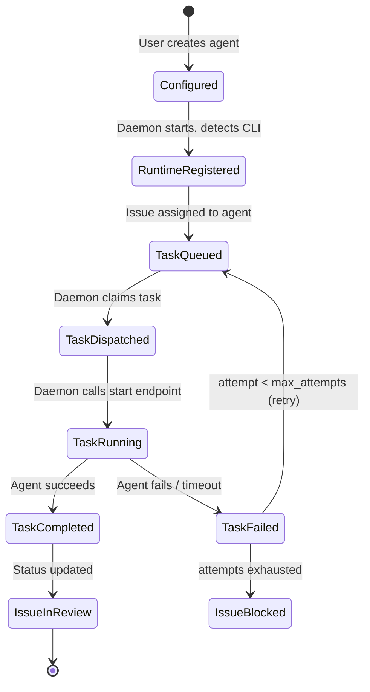
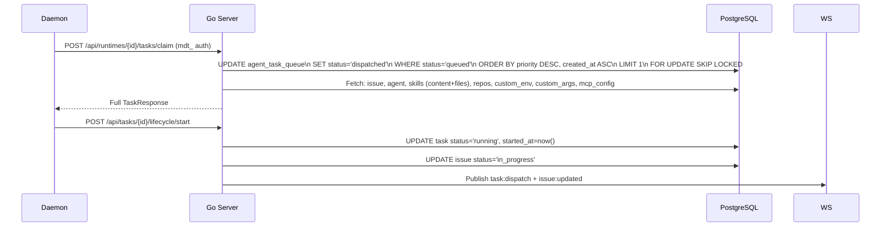

# Backend: Agent Lifecycle Management

## Agent vs. Runtime: Two Different Things

> [!NOTE] Common Point of Confusion
> "Agent" has two related meanings in Multica:
> - **The agent record** (`agent` table) — a named configuration (instructions, model, skills). The *job description*.
> - **The agent runtime** (`agent_runtime` table) — a concrete execution environment on some machine. The *actual employee showing up to work*.
>
> An agent without a runtime is configured but idle. An agent with an active runtime can receive tasks.

---

## Full Lifecycle Flow



---

## Phase 1: Configuration

```
User creates agent → POST /api/agents
  → agent row: name, instructions, model, visibility, runtime_mode
  → agent_runtime row linked via runtime_id

User attaches skills → POST /api/agents/{id}/skills/{skillId}
  → agent_skill junction rows
```

---

## Phase 2: Runtime Registration

```
multica daemon starts on developer's machine
  → detects installed CLIs (claude, codex, cursor, gemini…)
  → POST /api/workspaces/{slug}/daemon/register
  → receives daemon_token (mdt_...) scoped to workspace

For each detected CLI provider:
  → POST /api/runtimes
  → agent_runtime row: status=online, daemon_id, device_info, provider

Begins heartbeat loop:
  → POST /api/runtimes/{id}/heartbeat every ~30s
  → Updates last_seen_at
```

---

## Phase 3: Task Queuing

When `PATCH /api/issues/{id}` sets `assignee_type='agent'`:

```go
// service/task.go
func (s *TaskService) EnsureTaskQueued(ctx context.Context, issue db.Issue) {
    // INSERT INTO agent_task_queue (
    //   agent_id, runtime_id, issue_id,
    //   status='queued', priority=..., attempt=1, max_attempts=3
    // ) ON CONFLICT DO NOTHING  ← prevents double-queueing
}
```

Then: `DaemonHub.NotifyTaskAvailable(runtimeID, taskID)` sends a wakeup via WebSocket.

---

## Phase 4: Task Claim and Dispatch



**Task claim uses `FOR UPDATE SKIP LOCKED`** — this ensures two daemon nodes can never claim the same task even under concurrent load.

---

## Phase 5: Execution Environment Setup

Before spawning the agent CLI, the daemon:

1. **Writes skill files** — each attached skill's `content` as `SKILL.md`, plus `skill_file` rows, into a temp directory
2. **Checks out git repo** — creates a Git worktree for isolation (concurrent tasks don't interfere)
3. **Sets environment variables** — from `agent.custom_env` JSONB
4. **Builds CLI arguments** — base args + `agent.custom_args` + task-specific args

---

## Phase 6: Agent CLI Execution

```go
// server/pkg/agent/agent.go — unified interface
type Backend interface {
    Execute(ctx context.Context, prompt string, opts ExecOptions) (*Session, error)
}

type ExecOptions struct {
    Cwd                       string
    Model                     string
    SystemPrompt              string
    MaxTurns                  int
    Timeout                   time.Duration
    SemanticInactivityTimeout time.Duration
    ResumeSessionID           string       // empty = fresh start
    ExtraArgs                 []string     // daemon-wide defaults
    CustomArgs                []string     // per-agent overrides
    McpConfig                 json.RawMessage
}
```

The daemon reads `Session.Messages` (streaming events) and `Session.Result` (final outcome).

---

## Supported Agent Providers

| File | Provider | CLI |
|------|----------|-----|
| `claude.go` | Claude Code | `claude` |
| `codex.go` | OpenAI Codex | `codex` |
| `copilot.go` | GitHub Copilot | `gh copilot` |
| `cursor.go` | Cursor | `cursor` |
| `gemini.go` | Google Gemini | `gemini` |
| `hermes.go` | Hermes ACP | `hermes` |
| `kimi.go` | Kimi | `kimi` |
| `kiro.go` | Kiro | `kiro` |
| `openclaw.go` | OpenClaw | `openclaw` |
| `opencode.go` | OpenCode | `opencode` |
| `pi.go` | Pi | `pi` |

All providers produce a unified stream of `agent.Message` structs (text, tool_use, tool_result, status, error).

---

## Phase 7: Session Pinning (Crash Recovery)

```
Early in execution — agent emits first status message with session_id

Daemon → POST /api/tasks/{id}/pin-session {session_id, work_dir}
  → DB: UPDATE agent_task_queue SET session_id=..., work_dir=...

If daemon crashes after this point:
  → Next retry can pass ResumeSessionID to agent CLI
  → Agent continues from where it left off
  → No wasted work
```

> [!CAUTION] No Session ID = No Resume
> Some providers don't emit a session_id in their status messages. If `session_id` is never pinned, retries must start from scratch. This is a provider-specific limitation.

---

## Phase 8: Completion or Failure

**Success:**
```
Daemon → POST /api/tasks/{id}/complete {output, pr_url}
  → task status: running → completed
  → issue status: in_progress → in_review
  → If PR URL: upsert github_pull_request + issue_pull_request
  → Publish task:completed + issue:updated
  → NotificationListener → inbox_item for each subscriber
```

**Failure and Retry:**
```
Daemon → POST /api/tasks/{id}/fail {error, reason}

TaskService.MaybeRetryFailedTask():
  if attempt < max_attempts:
    INSERT new agent_task_queue (status='queued', attempt+1)
    UPDATE issue status → 'todo'
  else:
    UPDATE issue status → 'blocked'
    
Publish task:failed + issue:updated
```

---

## Runtime Sweeper

A background goroutine runs every ~30 seconds:

```
Find runtimes where last_seen_at < now() - 75s
  → Mark as status='offline'
  → Find tasks in status='running' on those runtimes
  → Call HandleFailedTasks() on each
    → Applies same retry logic as daemon /fail endpoint
```

> [!NOTE] 75-Second Grace Period
> The 75-second threshold is intentionally longer than the ~30-second heartbeat interval, giving one missed heartbeat as grace before declaring a runtime dead.

## Orphan Recovery

At daemon startup, before claiming new tasks:

```
POST /api/runtimes/{id}/recover
  → Find tasks in 'dispatched' or 'running' state for this runtime
  → Fail them immediately (don't wait for sweeper)
  → Apply retry logic (MaybeRetryFailedTask)
```

This prevents issues from getting stuck in `in_progress` when a daemon restarts mid-task.

---

## Task Concurrency

Each agent has `max_concurrent_tasks` (default: 1). The claim query enforces this:

```sql
WHERE agent_id = ? AND status = 'queued'
AND (
  SELECT COUNT(*) FROM agent_task_queue 
  WHERE agent_id = ? AND status = 'running'
) < max_concurrent_tasks
```

> [!TIP] Concurrency is per-agent, not per-runtime. An agent with `max_concurrent_tasks=3` on a single runtime runs three tasks simultaneously on one machine.

---

## Agent Visibility

| Value | Who can use this agent |
|-------|----------------------|
| `workspace` | Any workspace member |
| `private` | Only `owner_id` and workspace admins |

Checked in `loadAgentForUser()` and `canUseRuntimeForAgent()`.

---

## Squads: Multi-Agent Coordination

When a squad is assigned an issue:
1. Squad's leader agent receives a "briefing" task (`is_leader_task=true`)
2. Leader decides how to distribute work (creates sub-issues, assigns to squad members)
3. Individual agents in the squad claim their sub-tasks
4. Each sub-task is a standard `agent_task_queue` row with `parent_task_id` pointing to the leader task

---

## Key Fragility Points

> [!WARNING] Daemon Token Security
> Daemon tokens are long-lived and workspace-scoped. If one leaks, anyone with it can claim tasks and report fake completions. Rotation and audit logging are important for SaaS.

> [!WARNING] Skill Materialization at Claim Time
> All attached skills are materialized at task claim time. If an agent has many large skills (100KB+ each), claim calls can be slow. No caching of materialized content.

> [!WARNING] max_attempts Counter
> Default is 3 total attempts (2 retries). After exhaustion, the issue goes to `blocked` and requires manual intervention. There's no exponential backoff between retries — the next attempt is queued immediately.

---

## Related Documents

- [[architecture-overview]] — System overview
- [[data-flow]] — Task lifecycle data flow
- [[backend/01-handler-layer]] — Daemon handler endpoints
- [[backend/02-websocket-realtime]] — Daemon hub wakeup flow
- [[backend/06-skill-knowledge-system]] — How skills are materialized
- [[integrations]] — Adding a new agent provider
- [[database/schema]] — agent_task_queue schema
