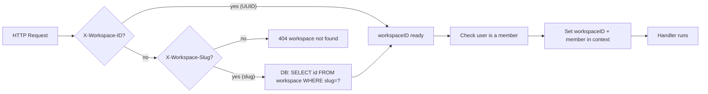
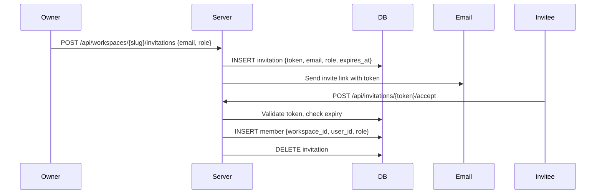

# Backend: Workspace and Multi-Tenancy Logic

## Current Architecture: Logical Multi-Tenancy

> [!NOTE] This Is the Standard SaaS Pattern
> Multica uses logical multi-tenancy — all workspaces share one database, isolation enforced at the application layer via `workspace_id` column filters. This is how Linear, Notion, and most SaaS products work.

All workspace-scoped tables have:

```sql
workspace_id UUID NOT NULL REFERENCES workspace(id) ON DELETE CASCADE
```

The CASCADE delete means removing a workspace deletes all its agents, issues, comments, tasks, skills, etc.

---

## The Workspace Data Model

```sql
CREATE TABLE workspace (
    id UUID PRIMARY KEY DEFAULT gen_random_uuid(),
    name TEXT NOT NULL,
    slug TEXT UNIQUE NOT NULL,         -- URL-safe: "my-team"
    description TEXT,
    settings JSONB NOT NULL DEFAULT '{}',
    issue_prefix TEXT,                 -- "MUL" → issues are MUL-1, MUL-2…
    created_at TIMESTAMPTZ NOT NULL DEFAULT now(),
    updated_at TIMESTAMPTZ NOT NULL DEFAULT now()
);

CREATE TABLE member (
    workspace_id UUID NOT NULL REFERENCES workspace(id) ON DELETE CASCADE,
    user_id UUID NOT NULL REFERENCES "user"(id) ON DELETE CASCADE,
    role TEXT NOT NULL CHECK (role IN ('owner', 'admin', 'member')),
    UNIQUE(workspace_id, user_id)      -- One role per user per workspace
);
```

---

## How Workspace ID Flows Through a Request

Every API request touching workspace data must include the workspace identifier. Two ways:

| Method | Header / Param | Used By |
|--------|---------------|---------|
| UUID | `X-Workspace-ID` | Desktop app, CLI |
| Slug | `X-Workspace-Slug` or URL param | Web app, API calls |

The middleware resolves slug → UUID transparently via a DB lookup.



---

## Workspace Slug System

The slug is the workspace's public URL identifier (e.g., `/my-team/issues`).

**Rules:**
- Lowercase alphanumeric with hyphens: `^[a-z][a-z0-9-]*[a-z0-9]$`
- Globally UNIQUE (database constraint)
- Not on the reserved slug list

### Reserved Slugs

> [!IMPORTANT] Single Source of Truth
> The reserved slug list lives in **one** place: `server/internal/handler/reserved_slugs.json`
> A TypeScript mirror is auto-generated: `packages/core/paths/reserved-slugs.ts`
> CI validates the generated file matches the JSON. Drift causes CI failure.

Examples of reserved slugs: `login`, `logout`, `api`, `admin`, `settings`, `issues`, `agents`, `invite`, `auth`.

**When you add a new top-level web route:** Add the slug to the JSON, run `pnpm generate:reserved-slugs`, commit both files.

### Issue Prefixes

Each workspace has an `issue_prefix` (e.g., "MUL" → issues are MUL-1, MUL-2…). `loadIssueForUser()` accepts both UUID and `PREFIX-N` format. The prefix is generated from the workspace name if not explicitly set.

---

## Role-Based Access Control

Three roles: `owner` > `admin` > `member`

| Action | owner | admin | member |
|--------|:-----:|:-----:|:------:|
| View workspace content | ✓ | ✓ | ✓ |
| Create/edit issues | ✓ | ✓ | ✓ |
| Create/edit agents | ✓ | ✓ | ✓ |
| Invite new members | ✓ | ✓ | ✗ |
| Remove members | ✓ | ✓ | ✗ |
| Change member roles | ✓ | ✗ | ✗ |
| Delete workspace | ✓ | ✗ | ✗ |
| Create daemon tokens | ✓ | ✓ | ✗ |

Enforced via `requireWorkspaceRole()`:

```go
member, ok := h.requireWorkspaceRole(w, r, workspaceID, "workspace not found", "owner", "admin")
if !ok {
    return // already wrote 403
}
```

> [!CAUTION] Owner Protection
> There must always be at least one owner. Removing or demoting the last owner is blocked to prevent workspace orphaning.

---

## Middleware Chain

```
Request
  ↓
Auth middleware (JWT/PAT validation → sets X-User-ID)
  ↓
RequireWorkspaceMember middleware:
  - Resolves workspace from header/URL
  - Verifies user is a member
  - Sets workspaceID + member in request context
  ↓
Handler (reads ctxWorkspaceID() and ctxMember())
```

Routes that bypass workspace membership check:
- `/api/auth/*` — authentication endpoints
- `GET /api/workspaces` — listing user's workspaces
- `GET /api/me` — current user info
- `/api/daemon/*` — daemon endpoints (separate auth)

---

## Isolation Guarantees

**Database level:**
- All workspace-scoped tables have `workspace_id UUID NOT NULL`
- `GetIssueInWorkspace` pattern adds `AND workspace_id = $2` to every lookup
- Cascade delete handles cleanup

**Application level:**
- Middleware enforces workspace membership before any handler runs
- Cross-workspace data leakage requires both: bypassing middleware AND using bare `GetIssue` instead of `GetIssueInWorkspace`

> [!WARNING] No Row-Level Security (RLS)
> Isolation is **application-layer only** — no PostgreSQL RLS. Bugs in handler code can expose cross-workspace data (incidents: #2143, #2147, #2192 referenced in codebase). For high-compliance SaaS verticals, consider adding RLS. See [[what-to-change-for-saas]].

---

## Workspace Invitations



---

## Daemon Token Scoping

Daemon tokens are workspace-scoped:

```sql
CREATE TABLE daemon_token (
    token_hash TEXT UNIQUE NOT NULL,
    workspace_id UUID NOT NULL REFERENCES workspace(id) ON DELETE CASCADE,
    daemon_id TEXT NOT NULL,
    expires_at TIMESTAMPTZ NOT NULL
);
```

When a daemon authenticates, the middleware extracts `workspace_id` from the token and sets it in context. All daemon API calls are automatically scoped — the daemon **cannot** access any other workspace.

---

## Multi-Workspace Users

A single user can belong to multiple workspaces:
- `user` table is workspace-agnostic
- `member` table creates the relationship
- `GET /api/workspaces` returns all workspaces the user is a member of
- Each workspace has its own WebSocket connection and query cache key

---

## Related Documents

- [[backend/05-authentication-access-control]] — Auth middleware details
- [[backend/01-handler-layer]] — Handler patterns and role checks
- [[database/schema]] — Workspace and member tables
- [[what-to-change-for-saas]] — What to change for production SaaS isolation
- [[glossary]] — Definitions of workspace, member, role, slug
