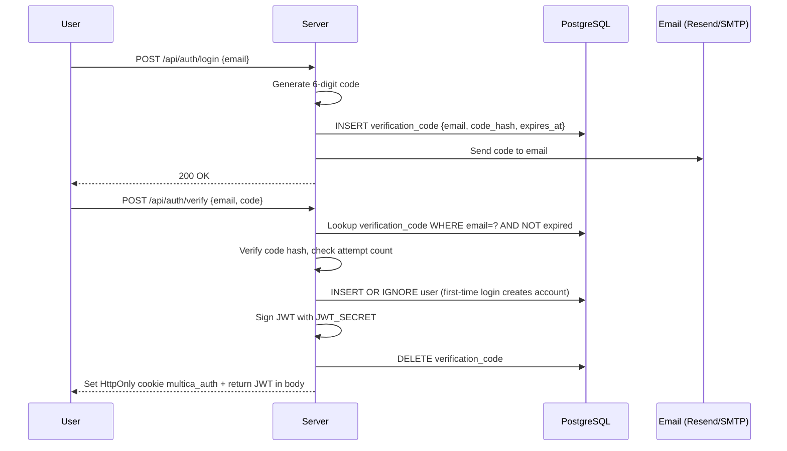
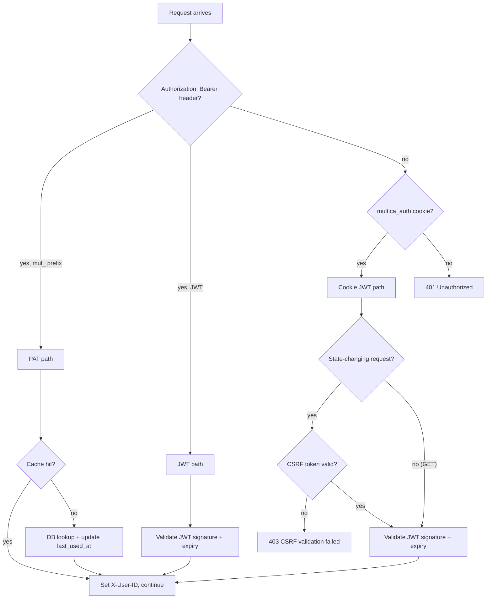

# Backend: Authentication and Access Control

## Authentication Methods

| Method | Token Format | Used By | Lifetime |
|--------|-------------|---------|---------|
| Email magic-link + JWT | HttpOnly cookie `multica_auth` | Web browser sessions | Hours (configurable) |
| Personal Access Token | `mul_` prefix (40 hex chars) | CLI, API integrations | Until revoked |
| Daemon Token | `mdt_` prefix (40 hex chars) | Local agent daemon | Short-lived, workspace-scoped |

---

## Email Magic-Link Flow

No passwords. Authentication via a 6-digit verification code sent to the user's email.



**Development bypass:** `MULTICA_DEV_VERIFICATION_CODE` env var sets a static code. Rejected in `APP_ENV=production`.

**Email backend fallback:** If neither `RESEND_API_KEY` nor `SMTP_HOST` is configured, the code is printed to the server log (development only).

> [!CAUTION] JWT_SECRET Default
> The server logs a warning but **continues to run** if `JWT_SECRET` is not set, using the hardcoded default `"multica-dev-secret-change-in-production"`. For production SaaS, change this to a hard failure (`os.Exit(1)`) in `server/cmd/server/main.go`. See [[what-to-change-for-saas]].

---

## Personal Access Tokens (PAT)

Long-lived API tokens for CLI and programmatic access.

**Format:** `mul_` + 40 random hex characters (20 bytes of entropy)

```sql
CREATE TABLE personal_access_token (
    id UUID PRIMARY KEY,
    token_hash TEXT UNIQUE NOT NULL,   -- SHA-256(token) only — plaintext never stored
    user_id UUID NOT NULL REFERENCES "user"(id) ON DELETE CASCADE,
    workspace_id UUID REFERENCES workspace(id) ON DELETE CASCADE, -- optional scope
    name TEXT NOT NULL,
    expires_at TIMESTAMPTZ,            -- NULL = never expires
    last_used_at TIMESTAMPTZ,
    created_at TIMESTAMPTZ NOT NULL DEFAULT now()
);
```

**PAT Caching:** `auth.PATCache` caches positive lookups with a short TTL (~5 min). On cache hit:
- Skips the DB SELECT
- Skips the `last_used_at` UPDATE (accuracy within TTL window, not per-request)
- Cache is in-memory per-node; Redis-backed when `REDIS_URL` is set (shared across nodes)

---

## Daemon Tokens

Workspace-scoped short-lived tokens for the daemon process.

**Format:** `mdt_` + 40 random hex characters

```sql
CREATE TABLE daemon_token (
    id UUID PRIMARY KEY,
    token_hash TEXT UNIQUE NOT NULL,
    workspace_id UUID NOT NULL REFERENCES workspace(id) ON DELETE CASCADE,
    daemon_id TEXT NOT NULL,
    expires_at TIMESTAMPTZ NOT NULL   -- Always enforced
);
```

When daemon authenticates, middleware extracts `workspace_id` from token → all subsequent calls automatically scoped to that workspace only.

---

## Authentication Middleware

`server/internal/middleware/auth.go` runs before every protected route:



---

## CSRF Protection

Cookie-based sessions require CSRF validation for state-changing requests (POST, PATCH, PUT, DELETE):

- **Required:** `X-CSRF-Token` header OR `_csrf` form field
- **Exempted:** Requests using `Authorization: Bearer` header (token proves intent)

---

## Agent Identity Resolution

> [!IMPORTANT] Security-Critical Code
> `resolveActor()` in `server/internal/handler/handler.go` is a security boundary. It was hardened in PR #2359 after discovering that `X-Agent-ID` alone could be used to impersonate agents.

```go
func (h *Handler) resolveActor(r *http.Request, userID, workspaceID string) (actorType, actorID string) {
    agentID := r.Header.Get("X-Agent-ID")
    taskID := r.Header.Get("X-Task-ID")
    
    // BOTH headers required — X-Agent-ID alone is rejected
    if agentID == "" || taskID == "" {
        return "member", userID
    }
    
    // Verify agent exists in this workspace
    agent, err := h.Queries.GetAgent(ctx, agentUUID)
    if err != nil || agent.WorkspaceID != workspaceID {
        return "member", userID  // silently fall back
    }
    
    // Verify the task belongs to THIS agent
    task, err := h.Queries.GetAgentTask(ctx, taskUUID)
    if err != nil || task.AgentID != agentID {
        return "member", userID  // silently fall back
    }
    
    return "agent", agentID  // only trust if both checks pass
}
```

**Why both headers?** A workspace member can observe an agent's UUID in API responses. If `X-Agent-ID` alone were trusted, any member could impersonate an agent. Requiring `X-Task-ID` means the caller must know the task UUID, which is only distributed to the daemon that legitimately claimed the task.

---

## WebSocket Authentication

Browsers cannot set custom headers on WebSocket upgrades, so auth uses a different approach:

**Cookie mode (web browser):**
1. Browser connects to `GET /api/ws?workspace_slug=...`
2. `multica_auth` cookie is sent automatically with the upgrade request
3. Server validates cookie → responds with `auth_ack` immediately

**Token mode (non-cookie clients):**
1. Client connects to `GET /api/ws?workspace_slug=...`
2. Client sends first message: `{ type: "auth", payload: { token: "JWT..." } }`
3. Server validates JWT → responds with `auth_ack`

> [!NOTE] Token Not in URL
> The token is **never** sent as a URL query parameter. URL parameters are logged by proxies, CDNs, and browser history — a serious security risk for auth tokens.

---

## Signup Restrictions

The `handler.Config` controls who can create accounts:

| Config | Effect |
|--------|--------|
| `AllowSignup: true` | Anyone can sign up |
| `AllowSignup: false` | No new accounts |
| `AllowedEmails: [...]` | Only specific addresses |
| `AllowedEmailDomains: [...]` | Only specific domains |

Checked during `POST /api/auth/verify`. Errors: `ErrSignupProhibited` or `ErrEmailNotAllowed`.

> [!NOTE] For SaaS
> These restriction fields are appropriate for self-hosted instances. For SaaS, replace with a proper registration+subscription flow. See [[what-to-change-for-saas]].

---

## Security Assessment

**What the codebase does well:**
- ✅ HttpOnly cookies prevent XSS token theft
- ✅ CSRF protection for cookie-based sessions
- ✅ PAT hashing with SHA-256 (plaintext never stored)
- ✅ Daemon impersonation prevention (both `X-Agent-ID` + `X-Task-ID` required)
- ✅ UUID validation preventing silent zero-UUID bugs
- ✅ Token format prefixes (`mul_`, `mdt_`) prevent type confusion

**Gaps to address for SaaS:**

| Gap | Risk | Fix |
|-----|------|-----|
| `JWT_SECRET` has a default value | Critical — any instance with default secret can forge tokens for any other | Make it required at startup |
| No refresh token system | Medium — users must re-auth via email after JWT expiry | Add refresh token flow |
| No SSO/SAML/OIDC | Medium for enterprise | Add Okta/Azure AD support |
| No rate limiting on auth endpoints | Medium | Add at proxy/CDN layer |
| Daemon token rotation not automated | Low | Add auto-renewal |

---

## Related Documents

- [[backend/04-workspace-multitenancy]] — Workspace membership and RBAC
- [[backend/01-handler-layer]] — Where auth helpers are used
- [[backend/02-websocket-realtime]] — WebSocket auth flow
- [[what-to-change-for-saas]] — Full SaaS security gap analysis
- [[glossary]] — JWT, PAT, CSRF, daemon token definitions
