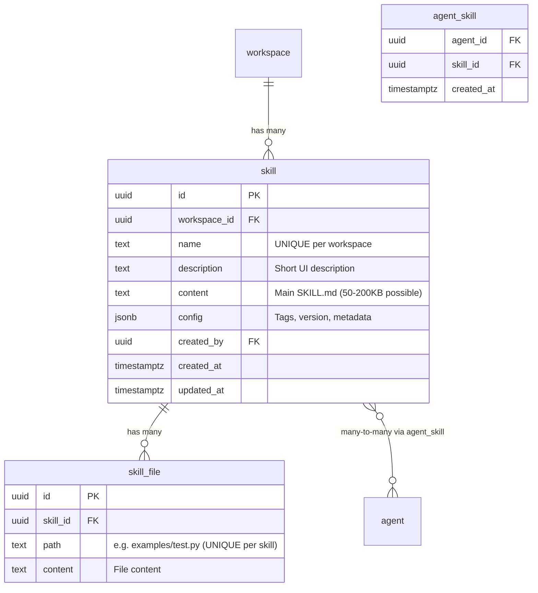
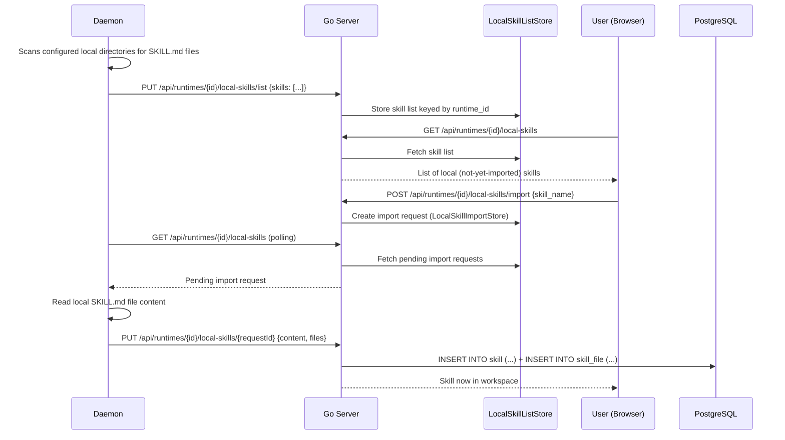

# Backend: Skill and Knowledge System

## What Skills Are

A **skill** is a named markdown document — essentially a reference manual — that can be attached to an agent and injected into the agent's working directory when it executes a task.

> [!NOTE] Mental Model
> Think of skills like giving an employee a handbook before sending them to do a job. The agent reads the skill document as part of its context. Multiple skills can be attached to one agent; the same skill can be used by many agents.

---

## Data Model



---

## How Skills Are Used During Task Execution

When the daemon claims a task, it receives the full skill content. The daemon then:

```
1. Create temp working directory for the task
2. For each attached skill:
   - Write skill.content → /tmp/task-abc/skills/{skill-name}/SKILL.md
   - Write each skill_file.content → /tmp/task-abc/skills/{skill-name}/{path}
3. Spawn agent CLI in this directory
```

The agent CLI reads these files as part of its context, following any instructions or examples in the SKILL.md.

---

## The Payload Size Problem

> [!CAUTION] Critical Performance Issue — Already Solved
> Skill content can be 50-200KB per skill. Shipping `content` in list responses caused **15-second CLI timeouts** from high-latency regions (issue #2174). The fix: two query variants.

| Query | Columns | Used By |
|-------|---------|---------|
| `ListSkillsByWorkspace` | All including `content` | **Never used in list endpoints** |
| `ListSkillSummariesByWorkspace` | All **except** `content` | List endpoints, CLI table view |
| `ListAgentSkills` | All including `content` | Full detail fetches |
| `ListAgentSkillSummaries` | All **except** `content` | Agent skill list in UI |

> [!IMPORTANT] If you add a new list endpoint that returns skills, always use the summary variant. The detail endpoint is the only place that should return full content.

---

## pgvector: Installed But Not Wired Up

> [!WARNING] Major Capability Gap
> `pgvector` is installed (part of the `pgvector/pgvector:pg17` Docker image). The database supports vector columns. However, **no table in the current schema has a `vector` column**. The skill table has no embedding. Skill retrieval is by:
> - Exact name match
> - Full list scan filtered by workspace_id
> - Agent-specific joins
>
> There is **no semantic search**, **no "find the most relevant skill"**, and **no vector similarity query** in the codebase.

### What It Would Take to Add Semantic Skill Search

1. **Add vector column** to the `skill` table:
   ```sql
   ALTER TABLE skill ADD COLUMN embedding vector(1536);
   CREATE INDEX ON skill USING hnsw (embedding vector_cosine_ops);
   ```

2. **Build embedding pipeline** — call an embedding API when skills are created or updated:
   ```go
   // On skill create/update, call OpenAI/Anthropic embeddings API
   embedding := embedText(skill.Content + " " + skill.Description)
   db.UpdateSkillEmbedding(skillID, embedding)
   ```

3. **Write a similarity query**:
   ```sql
   SELECT id, name, description
   FROM skill
   WHERE workspace_id = $1
   ORDER BY embedding <=> $2  -- cosine similarity
   LIMIT 5;
   ```

4. **Integrate into task claim** — when the daemon fetches task context, retrieve the top-N most relevant skills rather than all attached skills.

> [!TIP] The infrastructure cost is low — pgvector is already installed. The work is building the embedding pipeline (API calls on skill create/update) and a migration to add the vector column.

---

## Local Skills (Daemon-Reported)

Skills can exist on the developer's machine before being imported into a workspace.



> [!WARNING] Ephemeral Without Redis
> Local skill lists and import requests are stored in-memory by default. Without `REDIS_URL`, they disappear on server restart. Users find this surprising — local skills they saw before restart appear gone. Redis makes these stores persistent and cross-node.

---

## Skill Assignment API

| Endpoint | What it does |
|----------|-------------|
| `GET /api/agents/{id}/skills` | List skills attached to this agent (summary, no content) |
| `POST /api/agents/{id}/skills/{skillId}` | Attach a skill (`ON CONFLICT DO NOTHING`) |
| `DELETE /api/agents/{id}/skills/{skillId}` | Detach a skill |
| `PUT /api/agents/{id}/skills` | Replace all attached skills at once (batch set) |

---

## Agent Templates and Skill Find-or-Create

When creating a workspace from a template, skills in the template are materialized via find-or-create:

```sql
-- GetSkillByWorkspaceAndName: if skill already exists, reuse it
SELECT * FROM skill WHERE workspace_id = $1 AND name = $2
```

If the skill exists, the template reuses it rather than inserting a duplicate (which would violate `UNIQUE(workspace_id, name)`).

---

## The `sanitizeNullBytes` Function

> [!NOTE] Quirky but Necessary
> `server/internal/handler/skill.go` contains `sanitizeNullBytes()` which removes embedded NUL bytes (0x00) and invalid UTF-8 sequences from skill content before writing to PostgreSQL. This was added after real failures during skill import from Windows machines:
> - Embedded NUL → PostgreSQL SQLSTATE 22021 error
> - Windows-1252 encoded smart quotes (0x91) → invalid UTF-8 in PostgreSQL TEXT column
>
> The function uses `strings.ToValidUTF8` + `strings.ReplaceAll` to handle both cases.

---

## Developer Checklist Before Modifying Skills

- [ ] Never return `content` in list endpoints — use summary variant queries
- [ ] Skill names are UNIQUE per workspace — handle 23505 uniqueness violation on rename
- [ ] pgvector is available but not wired — if you want semantic search, you need to build the embedding pipeline
- [ ] Local skills are ephemeral without Redis — document this for users
- [ ] Run `sanitizeNullBytes()` on any user-supplied content before INSERT/UPDATE

---

## Related Documents

- [[backend/03-agent-lifecycle]] — How skills are materialized during task execution
- [[backend/01-handler-layer]] — Skill handler endpoints
- [[database/schema]] — skill, skill_file, agent_skill tables
- [[integrations]] — Agent providers that consume skills
- [[what-to-change-for-saas]] — pgvector as a future capability
