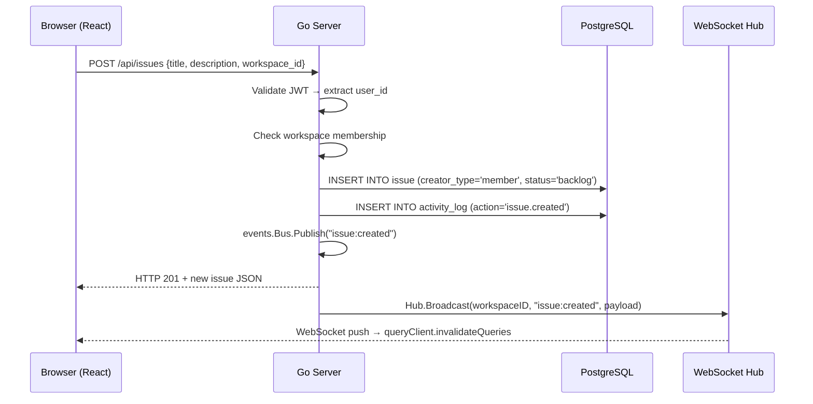
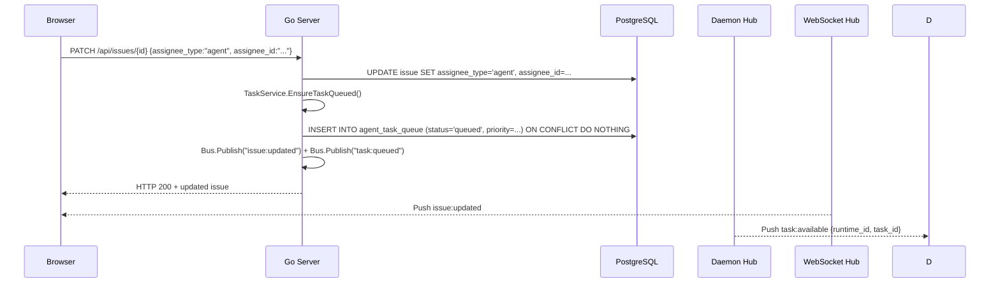
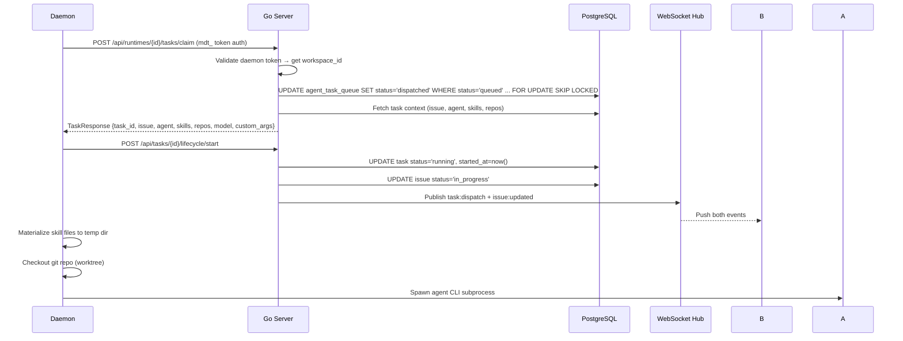
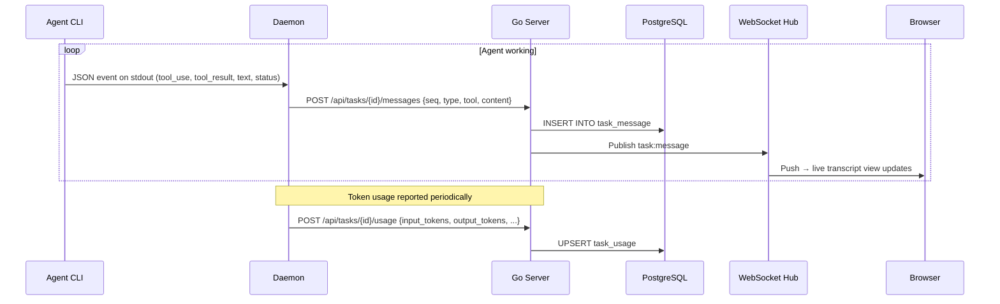
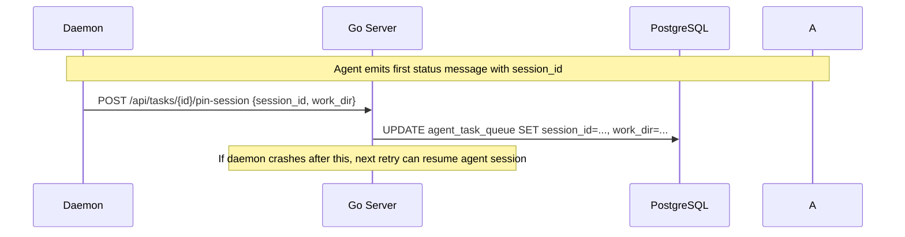
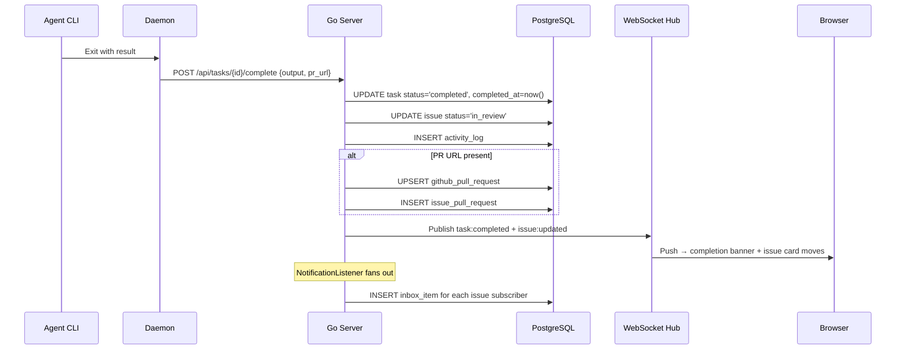
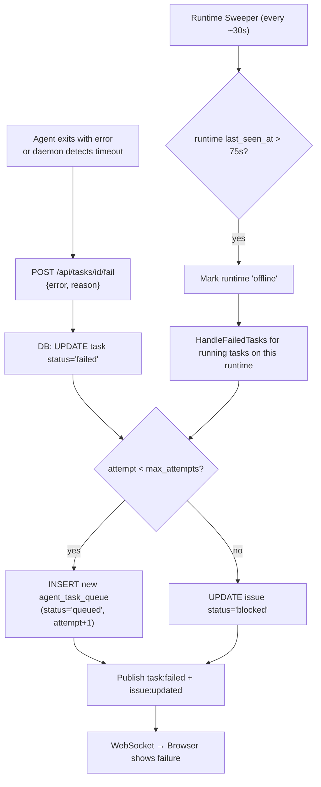

# Data Flow: Full Task Lifecycle

This document traces the complete lifecycle of a task — from a user creating an issue, through assigning it to an agent, watching the agent execute, and the issue reaching completion — showing exactly how data moves between every layer of the system.

---

## Phase 1: Issue Creation

**What the user does:** Types a title and description, clicks "Create."



> [!NOTE] Optimistic UI
> The HTTP response and WebSocket push happen nearly simultaneously. The frontend optimistically adds the issue on REST response, then the WS event confirms server state and triggers a cache refresh.

**Important detail:** The event bus delivers to multiple listeners simultaneously:
- `ActivityListener` — writes `activity_log` row
- `SubscriberListener` — adds creator as subscriber to the issue
- `NotificationListener` — fans out `inbox_item` rows

---

## Phase 2: Assigning to an Agent

**What the user does:** Opens the issue, selects an agent from the assignee dropdown.



> [!WARNING] Side Effect of PATCH
> When an issue is assigned to an agent, `UpdateIssue` calls `TaskService.EnsureTaskQueued()`. This is a side effect of a PATCH call. If you add new logic to issue updates, be careful not to accidentally trigger duplicate task creation. The `ON CONFLICT DO NOTHING` guards against it but the call still happens.

---

## Phase 3: Daemon Claims and Dispatches

**On the daemon side** (multica daemon running locally):



**Task context includes:**
- Issue title, description, acceptance criteria, context_refs
- Agent instructions (system prompt), model preference
- Attached skills — full SKILL.md content + supporting files
- Workspace repos (GitHub repos the agent may clone)
- Custom env vars, custom CLI args, MCP config

---

## Phase 4: Agent Execution and Progress Streaming



**Session pinning (crash recovery):**



---

## Phase 5: Task Completion



---

## Phase 6: Task Failure and Retry



> [!CAUTION] Sweeper Latency
> The Runtime Sweeper can take up to 75 seconds to notice a crashed daemon. For faster recovery, the daemon calls `POST /api/runtimes/{id}/recover` at startup, which immediately fails any orphaned tasks.

---

## The Event Bus Pattern

Every mutation in the system follows this pattern:

```
Handler writes to DB
  → Handler publishes event to Bus
    → Listeners fire side effects (activity log, notifications, subscribers)
    → Realtime listener broadcasts to WebSocket hub
      → Hub delivers to all connected clients in workspace
        → (optionally) Redis Streams relay to other nodes
```

| Listener | What it does |
|----------|-------------|
| Realtime broadcaster | Converts bus events into WebSocket broadcasts |
| Activity listener | Writes to `activity_log` table |
| Subscriber listener | Updates `issue_subscriber` table |
| Notification listener | Creates `inbox_item` rows |
| Autopilot listener | Triggers autopilot runs when issues close |

> [!WARNING] The Bus Is Not Durable
> The event bus is in-process only. If a listener throws or the process crashes after a DB write but before publishing, the event is lost. For SaaS billing or audit events, consider a durable queue (Postgres-backed events table or a message broker).

---

## Data Movement Summary

| From | To | Mechanism | Typical Latency |
|------|----|-----------|---------|
| Browser | Go Server | HTTPS REST | ~50ms |
| Go Server | Browser | WebSocket push | ~5ms after REST |
| Go Server | Daemon | WebSocket wakeup | ~5ms |
| Daemon | Go Server | HTTPS REST | ~50ms |
| Agent CLI | Daemon | stdout streaming | real-time |
| Daemon | Go Server (progress) | HTTPS REST (per message) | ~50ms each |
| Go Server | PostgreSQL | pgx connection pool | ~1-5ms |
| Go Server nodes | Each other | Redis Streams | ~5-20ms |

---

## Related Documents

- [[architecture-overview]] — System overview with component diagram
- [[backend/01-handler-layer]] — Handler implementation details
- [[backend/02-websocket-realtime]] — WebSocket system internals
- [[backend/03-agent-lifecycle]] — Agent lifecycle in depth
- [[database/schema]] — Full database schema
