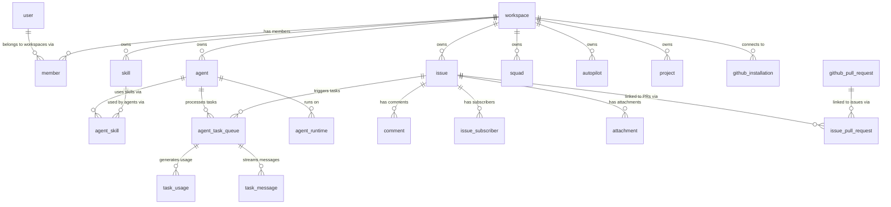

# Database Schema

## Database Engine

- **PostgreSQL 17** via the `pgvector/pgvector:pg17` Docker image
- **Extensions enabled:** `pgcrypto` (UUID generation), `pgvector` (vector search — installed but not yet used), `pg_cron` (scheduled rollup jobs — optional, falls back gracefully)
- **Query layer:** `sqlc` generates type-safe Go code from `.sql` files in `server/pkg/db/queries/`
- **Migrations:** sequential numbered files in `server/migrations/`; applied with `make migrate-up`

> [!NOTE] Migration Numbering
> There are 90+ migration files. Some numbers are duplicated with a suffix (e.g., `029_attachment`, `029_daemon_token`, `029_drop_daemon_pairing` — three distinct migrations all sharing the `029` prefix). This causes no problems in practice because golang-migrate uses filename ordering, but it's worth being aware of when adding new migrations.

---

## Schema Diagram (Core Tables)

---

## Table Reference

### Core Identity

#### `user`
The global user table. Not workspace-scoped — one row per human across all workspaces.

| Column | Type | Notes |
|--------|------|-------|
| `id` | UUID PK | `gen_random_uuid()` |
| `name` | TEXT | Display name |
| `email` | TEXT UNIQUE | Primary identifier |
| `avatar_url` | TEXT | Optional profile picture |
| `language` | TEXT | `'en'` or `'zh-Hans'` — server-validated |
| `onboarded_at` | TIMESTAMPTZ | Set after onboarding completion |
| `onboarding_state` | JSONB | Step tracking during wizard |
| `starter_content_state` | JSONB | Whether starter content was created |
| `cloud_waitlist` | BOOLEAN | Cloud waitlist flag |
| `created_at` / `updated_at` | TIMESTAMPTZ | Auto-set |

#### `workspace`
Top-level tenant unit.

| Column | Type | Notes |
|--------|------|-------|
| `id` | UUID PK | |
| `name` | TEXT | Display name |
| `slug` | TEXT UNIQUE | URL path identifier: `^[a-z][a-z0-9-]*[a-z0-9]$` |
| `description` | TEXT | Optional |
| `settings` | JSONB | Extensible workspace preferences |
| `issue_prefix` | TEXT | e.g. `"MUL"` → issues are `MUL-1`, `MUL-2` |
| `repos` | JSONB | Array of connected repository configs |
| `created_at` / `updated_at` | TIMESTAMPTZ | |

> [!IMPORTANT] Reserved Slugs
> The slug must not be on the reserved list in `server/internal/handler/reserved_slugs.json`. A TypeScript mirror lives at `packages/core/paths/reserved-slugs.ts` (auto-generated). Never edit the TS file directly — edit the JSON and run `pnpm generate:reserved-slugs`.

#### `member`
The workspace ↔ user relationship. One row per user per workspace.

| Column | Type | Notes |
|--------|------|-------|
| `id` | UUID PK | |
| `workspace_id` | UUID FK | CASCADE delete |
| `user_id` | UUID FK | CASCADE delete |
| `role` | TEXT | `'owner'`, `'admin'`, or `'member'` |
| `created_at` | TIMESTAMPTZ | |
| UNIQUE | `(workspace_id, user_id)` | One role per user per workspace |

---

### Agents and Runtimes

#### `agent`
Named AI agent configuration. NOT a running process — the configuration (instructions, model, skills).

| Column | Type | Notes |
|--------|------|-------|
| `id` | UUID PK | |
| `workspace_id` | UUID FK | CASCADE delete |
| `name` | TEXT | UNIQUE per workspace (migration 046) |
| `description` | TEXT | Shown in UI |
| `avatar_url` | TEXT | Optional |
| `instructions` | TEXT | System prompt / instructions |
| `model` | TEXT | Provider model string (e.g. `"claude-opus-4-5"`) |
| `runtime_mode` | TEXT | `'local'` or `'cloud'` |
| `runtime_config` | JSONB | Provider-specific runtime options |
| `visibility` | TEXT | `'workspace'` (all members) or `'private'` (owner + admins only) |
| `status` | TEXT | `'idle'`, `'working'`, `'blocked'`, `'error'`, `'offline'` |
| `max_concurrent_tasks` | INT | Default `1` |
| `custom_env` | JSONB | Extra env vars injected at execution |
| `custom_args` | JSONB | Extra CLI args appended per-agent |
| `mcp_config` | JSONB | MCP server config written to temp file during execution |
| `owner_id` | UUID FK | The creating user |
| `archived_at` | TIMESTAMPTZ | NULL = active |
| `created_at` / `updated_at` | TIMESTAMPTZ | |

#### `agent_runtime`
A concrete execution environment on a developer machine. The *actual process*, not the configuration.

| Column | Type | Notes |
|--------|------|-------|
| `id` | UUID PK | |
| `workspace_id` | UUID FK | |
| `agent_id` | UUID FK | Which agent this runtime serves |
| `daemon_id` | UUID | The daemon process that registered it |
| `owner_id` | UUID FK | The user who owns the daemon |
| `provider` | TEXT | `'claude'`, `'codex'`, `'cursor'`, etc. |
| `status` | TEXT | `'online'` or `'offline'` |
| `last_seen_at` | TIMESTAMPTZ | Updated on heartbeat; sweeper checks this |
| `device_info` | JSONB | Hostname, OS, arch, CLI version |
| `timezone` | TEXT | Daemon machine timezone |
| `visibility` | TEXT | `'workspace'` or `'private'` |
| `created_at` / `updated_at` | TIMESTAMPTZ | |

> [!NOTE] Runtime Sweeper
> A background goroutine marks runtimes offline when `last_seen_at < now() - 75s`. Tasks running on those runtimes are automatically failed and retried.

---

### Issues

#### `issue`
The primary work item. Polymorphic on `assignee` (member, agent, or squad).

| Column | Type | Notes |
|--------|------|-------|
| `id` | UUID PK | |
| `workspace_id` | UUID FK | CASCADE delete |
| `number` | INT | Auto-incremented per workspace (migration 020) |
| `title` | TEXT | |
| `description` | TEXT | Markdown |
| `status` | TEXT | `backlog`, `todo`, `in_progress`, `in_review`, `done`, `blocked`, `cancelled` |
| `priority` | TEXT | `urgent`, `high`, `medium`, `low`, `none` |
| `assignee_type` | TEXT | `'member'`, `'agent'`, or `'squad'` |
| `assignee_id` | UUID | References the member/agent/squad |
| `creator_type` | TEXT | `'member'` or `'agent'` |
| `creator_id` | UUID | |
| `parent_issue_id` | UUID FK | Nullable; self-reference for sub-issues |
| `project_id` | UUID FK | Nullable |
| `acceptance_criteria` | JSONB | Array of criteria objects |
| `context_refs` | JSONB | Array of context references |
| `position` | FLOAT | Kanban drag ordering |
| `due_date` | TIMESTAMPTZ | |
| `start_date` | TIMESTAMPTZ | |
| `origin_type` | TEXT | `'autopilot'` if created by automation |
| `origin_id` | UUID | FK to the autopilot |
| `first_executed_at` | TIMESTAMPTZ | When first agent task ran |
| `created_at` / `updated_at` | TIMESTAMPTZ | |

**Key indexes:**
- `(workspace_id)` — workspace scoping
- `(workspace_id, status)` — board/list views
- `(assignee_type, assignee_id)` — assigned work views
- `(parent_issue_id)` — sub-issue queries
- Full-text search index (migration 032) for keyword search

#### `issue_label` and `issue_to_label`
Labels are workspace-scoped. `issue_to_label` is the many-to-many junction.

#### `issue_dependency`
Tracks blocking relationships between issues. `type` is `'blocks'`, `'blocked_by'`, or `'related'`.

#### `issue_subscriber`
Who receives notifications for an issue. `reason` is one of: `creator`, `assignee`, `commenter`, `mentioned`, `manual`.

---

### Comments

#### `comment`
Polymorphic comment attached to an issue. Can be authored by a member or agent.

| Column | Type | Notes |
|--------|------|-------|
| `id` | UUID PK | |
| `workspace_id` | UUID FK | Added in migration 025 |
| `issue_id` | UUID FK | CASCADE delete |
| `parent_id` | UUID FK | Self-reference for threaded replies |
| `author_type` | TEXT | `'member'` or `'agent'` |
| `author_id` | UUID | |
| `content` | TEXT | Markdown |
| `type` | TEXT | `comment`, `status_change`, `progress_update`, `system` |
| `resolved_at` | TIMESTAMPTZ | When comment was resolved (nullable) |
| `created_at` / `updated_at` | TIMESTAMPTZ | |

#### `comment_reaction`
Emoji reactions on comments. `(comment_id, user_id, emoji)` unique constraint.

#### `issue_reaction`
Emoji reactions directly on issues.

---

### Agent Task Queue

#### `agent_task_queue`
The execution queue. One row per agent task attempt.

| Column | Type | Notes |
|--------|------|-------|
| `id` | UUID PK | |
| `agent_id` | UUID FK | CASCADE delete |
| `runtime_id` | UUID FK | Which runtime is handling it |
| `issue_id` | UUID FK | Nullable (chat tasks have no issue) |
| `chat_session_id` | UUID FK | Nullable (issue tasks have no chat session) |
| `autopilot_run_id` | UUID FK | Nullable |
| `status` | TEXT | `queued`, `dispatched`, `running`, `completed`, `failed`, `cancelled` |
| `priority` | INT | Higher = claimed first |
| `attempt` | INT | Which retry attempt (1-based) |
| `max_attempts` | INT | Default `3` |
| `session_id` | TEXT | Agent CLI session ID (for crash resume) |
| `work_dir` | TEXT | Temp directory path (for crash resume) |
| `lease_expires_at` | TIMESTAMPTZ | Prevents stuck dispatched tasks |
| `is_leader_task` | BOOLEAN | `true` for squad leader briefing |
| `parent_task_id` | UUID FK | Squad sub-task parent pointer |
| `trigger_comment_id` | UUID FK | Comment that triggered the task |
| `trigger_summary` | TEXT | Brief description of what triggered it |
| `force_fresh_session` | BOOLEAN | Override resume: start fresh |
| `dispatched_at` | TIMESTAMPTZ | |
| `started_at` | TIMESTAMPTZ | |
| `completed_at` | TIMESTAMPTZ | |
| `result` | JSONB | Completion output |
| `error` | TEXT | Failure message |
| `created_at` | TIMESTAMPTZ | |

> [!CAUTION] FOR UPDATE SKIP LOCKED
> The task claim query uses `FOR UPDATE SKIP LOCKED`. This is the correct pattern for queue implementations — it prevents two daemon nodes from claiming the same task under concurrent load. Never remove this from the claim query.

**Key indexes:**
- `(agent_id, status)` — claim candidate lookup
- `(runtime_id)` — runtime-specific task views
- Partial index on `status = 'queued'` (migration 080) — fast claim scan

#### `task_message`
Streamed messages from the agent CLI during execution. Used for the live transcript UI.

| Column | Type | Notes |
|--------|------|-------|
| `id` | UUID PK | |
| `task_id` | UUID FK | |
| `type` | TEXT | `text`, `tool_use`, `tool_result`, `status`, `error`, `thinking` |
| `content` | TEXT | |
| `tool` | TEXT | Tool name (tool_use/tool_result) |
| `call_id` | TEXT | Tool call ID for pairing use/result |
| `input` | JSONB | Tool input |
| `output` | TEXT | Tool output |
| `elapsed_ms` | INT | Wall time since task start |
| `created_at` | TIMESTAMPTZ | |

#### `task_usage`
Token consumption per task, per model.

| Column | Type | Notes |
|--------|------|-------|
| `task_id` | UUID FK | |
| `provider` | TEXT | e.g. `'anthropic'` |
| `model` | TEXT | e.g. `'claude-opus-4-5'` |
| `input_tokens` | BIGINT | |
| `output_tokens` | BIGINT | |
| `cache_read_tokens` | BIGINT | |
| `cache_write_tokens` | BIGINT | |
| UNIQUE | `(task_id, provider, model)` | Upsert-safe |

---

### Usage Analytics (Rollup)

#### `task_usage_daily`
Pre-aggregated daily rollup of `task_usage`. The dashboard reads from this table, not from raw events.

| Column | Type | Notes |
|--------|------|-------|
| `bucket_date` | DATE | PK component |
| `workspace_id` | UUID | PK component |
| `runtime_id` | UUID | PK component |
| `provider` | TEXT | PK component |
| `model` | TEXT | PK component |
| `input_tokens` | BIGINT | Summed for the day |
| `output_tokens` | BIGINT | |
| `cache_read_tokens` | BIGINT | |
| `cache_write_tokens` | BIGINT | |
| `event_count` | BIGINT | Number of raw events |
| `updated_at` | TIMESTAMPTZ | When last rolled up |

> [!NOTE] Rollup Architecture
> `task_usage_daily` is populated by the `rollup_task_usage_daily()` PostgreSQL function, scheduled via `pg_cron` every 5 minutes. There's also a `task_usage_rollup_state` table tracking the watermark. A 5-minute lag is intentional (visibility delay for concurrent writes). See migration 073.

#### `task_usage_rollup_state`
Single-row watermark tracking for the rollup function. Contains `watermark_at`, `last_run_started_at`, `last_run_finished_at`, `last_run_rows`, `last_error`.

#### `task_usage_dashboard_daily`
Secondary rollup for the usage dashboard page (migration 084). Similar structure, different aggregation granularity for the chart view.

---

### Skills

#### `skill`
A named markdown document that can be attached to agents. See [[backend/06-skill-knowledge-system]] for full details.

| Column | Type | Notes |
|--------|------|-------|
| `id` | UUID PK | |
| `workspace_id` | UUID FK | CASCADE delete |
| `name` | TEXT | UNIQUE per workspace |
| `description` | TEXT | Short UI description |
| `content` | TEXT | Main SKILL.md — **50-200KB possible** |
| `config` | JSONB | Tags, version, metadata |
| `created_by` | UUID FK | |
| `created_at` / `updated_at` | TIMESTAMPTZ | |

> [!CAUTION] Never Return `content` in List Queries
> `skill.content` can be 50-200KB. List endpoints must use `ListSkillSummariesByWorkspace` (omits `content`). Returning content in a list caused 15-second CLI timeouts from high-latency regions (issue #2174).

#### `skill_file`
Additional files attached to a skill (examples, configs, etc.).

| Column | Type | Notes |
|--------|------|-------|
| `id` | UUID PK | |
| `skill_id` | UUID FK | CASCADE delete |
| `path` | TEXT | Relative path, e.g. `examples/test.py` |
| `content` | TEXT | File content |
| UNIQUE | `(skill_id, path)` | |

#### `agent_skill`
Many-to-many junction between agents and skills.

| Column | Type | Notes |
|--------|------|-------|
| `agent_id` | UUID FK | CASCADE delete |
| `skill_id` | UUID FK | CASCADE delete |
| `created_at` | TIMESTAMPTZ | |
| PK | `(agent_id, skill_id)` | |

---

### Authentication

#### `verification_code`
Magic-link login codes. Short-lived; deleted on successful verification.

| Column | Type | Notes |
|--------|------|-------|
| `id` | UUID PK | |
| `email` | TEXT | Who requested the code |
| `code_hash` | TEXT | SHA-256 of the 6-digit code |
| `attempts` | INT | Brute-force protection counter |
| `expires_at` | TIMESTAMPTZ | |
| `created_at` | TIMESTAMPTZ | |

#### `personal_access_token`
Long-lived API tokens with `mul_` prefix.

| Column | Type | Notes |
|--------|------|-------|
| `id` | UUID PK | |
| `user_id` | UUID FK | CASCADE delete |
| `name` | TEXT | Human label |
| `token_hash` | TEXT UNIQUE | SHA-256 only — plaintext never stored |
| `token_prefix` | TEXT | First few chars for display in UI |
| `expires_at` | TIMESTAMPTZ | NULL = never |
| `last_used_at` | TIMESTAMPTZ | Updated on use (within cache TTL) |
| `revoked` | BOOLEAN | Soft-delete |
| `created_at` | TIMESTAMPTZ | |

#### `daemon_token`
Short-lived workspace-scoped tokens for the daemon process (`mdt_` prefix).

| Column | Type | Notes |
|--------|------|-------|
| `id` | UUID PK | |
| `token_hash` | TEXT UNIQUE | SHA-256 only |
| `workspace_id` | UUID FK | Scopes all daemon API calls |
| `daemon_id` | TEXT | The daemon instance identifier |
| `expires_at` | TIMESTAMPTZ | Always enforced |

---

### Invitations

#### `workspace_invitation`

| Column | Type | Notes |
|--------|------|-------|
| `id` | UUID PK | |
| `workspace_id` | UUID FK | |
| `inviter_id` | UUID FK | |
| `invitee_email` | TEXT | Target email |
| `invitee_user_id` | UUID FK | Set when invitee already has an account |
| `role` | TEXT | `'admin'` or `'member'` (cannot invite as owner) |
| `status` | TEXT | `pending`, `accepted`, `declined`, `expired` |
| `expires_at` | TIMESTAMPTZ | Default: 7 days from creation |

Partial unique index: `(workspace_id, invitee_email) WHERE status = 'pending'` — prevents duplicate pending invites.

---

### Projects

#### `project`
A grouping container for issues. Can have a lead (member or agent).

| Column | Type | Notes |
|--------|------|-------|
| `id` | UUID PK | |
| `workspace_id` | UUID FK | |
| `title` | TEXT | |
| `description` | TEXT | |
| `icon` | TEXT | Emoji or icon identifier |
| `status` | TEXT | `planned`, `in_progress`, `paused`, `completed`, `cancelled` |
| `lead_type` | TEXT | `'member'` or `'agent'` |
| `lead_id` | UUID | |
| `created_at` / `updated_at` | TIMESTAMPTZ | |

Issues have a nullable `project_id FK → project(id) ON DELETE SET NULL`.

#### `project_resource`
Links external resources (URLs, documents) to projects.

---

### Squads

#### `squad`
A named group of agents (and optionally members) with a designated leader agent.

| Column | Type | Notes |
|--------|------|-------|
| `id` | UUID PK | |
| `workspace_id` | UUID FK | |
| `name` | TEXT | Not globally unique (migration 087 removed uniqueness) |
| `description` | TEXT | |
| `instructions` | TEXT | Squad-wide instructions (migration 088) |
| `leader_id` | UUID FK → agent | RESTRICT delete — leader must be detached first |
| `avatar_url` | TEXT | |
| `archived_at` | TIMESTAMPTZ | NULL = active |
| `created_at` / `updated_at` | TIMESTAMPTZ | |

#### `squad_member`
Members of a squad. Can be agents or human members.

| Column | Type | Notes |
|--------|------|-------|
| `squad_id` | UUID FK | CASCADE delete |
| `member_type` | TEXT | `'agent'` or `'member'` |
| `member_id` | UUID | |
| `role` | TEXT | Optional role description within the squad |
| UNIQUE | `(squad_id, member_type, member_id)` | |

---

### Autopilots

#### `autopilot`
A scheduled or triggered automation.

| Column | Type | Notes |
|--------|------|-------|
| `id` | UUID PK | |
| `workspace_id` | UUID FK | |
| `project_id` | UUID FK | Nullable |
| `title` | TEXT | |
| `description` | TEXT | |
| `assignee_id` | UUID FK → agent | The agent that will execute runs |
| `priority` | TEXT | Default `'medium'` |
| `status` | TEXT | `active`, `paused`, `archived` |
| `execution_mode` | TEXT | `create_issue` (creates an issue then assigns) or `run_only` (direct task) |
| `issue_title_template` | TEXT | Template for auto-created issue title |
| `concurrency_policy` | TEXT | `skip`, `queue`, or `replace` when a run overlaps |
| `last_run_at` | TIMESTAMPTZ | |
| `created_at` / `updated_at` | TIMESTAMPTZ | |

#### `autopilot_trigger`
How the autopilot fires. One autopilot can have multiple triggers.

| Column | Type | Notes |
|--------|------|-------|
| `kind` | TEXT | `schedule`, `webhook`, or `api` |
| `cron_expression` | TEXT | For `schedule` kind |
| `timezone` | TEXT | Default `'UTC'` |
| `next_run_at` | TIMESTAMPTZ | Maintained by the autopilot scheduler |
| `webhook_token` | TEXT | For `webhook` kind; validated on incoming request |
| `enabled` | BOOLEAN | |

#### `autopilot_run`
One execution of an autopilot.

| Column | Type | Notes |
|--------|------|-------|
| `source` | TEXT | `schedule`, `manual`, `webhook`, `api` |
| `status` | TEXT | `pending`, `issue_created`, `running`, `skipped`, `completed`, `failed` |
| `issue_id` | UUID FK | The issue created (if `execution_mode=create_issue`) |
| `task_id` | UUID FK | The task that ran |
| `trigger_payload` | JSONB | Webhook/API payload |
| `failure_reason` | TEXT | |

---

### Chat

#### `chat_session`
An ongoing chat conversation between a human and an agent outside the issue context.

| Column | Type | Notes |
|--------|------|-------|
| `id` | UUID PK | |
| `workspace_id` | UUID FK | |
| `user_id` | UUID FK | The human participant |
| `agent_id` | UUID FK | The agent participant |
| `runtime_id` | UUID FK | Which runtime handles chat tasks |
| `title` | TEXT | Auto-generated or user-set |
| `unread_since` | TIMESTAMPTZ | For unread badge logic |
| `created_at` / `updated_at` | TIMESTAMPTZ | |

#### `chat_message`
Individual messages in a chat session.

| Column | Type | Notes |
|--------|------|-------|
| `id` | UUID PK | |
| `session_id` | UUID FK | CASCADE delete |
| `role` | TEXT | `'user'` or `'assistant'` |
| `content` | TEXT | Message text |
| `status` | TEXT | `'pending'`, `'completed'`, `'failed'` |
| `failure_reason` | TEXT | |
| `elapsed_ms` | INT | Response time |
| `created_at` | TIMESTAMPTZ | |

---

### GitHub Integration

#### `github_installation`
A GitHub App installation connected to a workspace.

| Column | Type | Notes |
|--------|------|-------|
| `installation_id` | BIGINT | GitHub's installation ID (UNIQUE) |
| `account_login` | TEXT | GitHub username or org name |
| `account_type` | TEXT | `'User'` or `'Organization'` |
| `account_avatar_url` | TEXT | |
| `connected_by_id` | UUID FK | Which user connected it |

#### `github_pull_request`
Mirrored pull request state from GitHub webhooks.

| Column | Type | Notes |
|--------|------|-------|
| `installation_id` | BIGINT | |
| `repo_owner` / `repo_name` / `pr_number` | TEXT/INT | UNIQUE composite key per workspace |
| `state` | TEXT | `open`, `closed`, `merged`, `draft` |
| `branch` | TEXT | Head branch |
| `author_login` / `author_avatar_url` | TEXT | |
| `merged_at` / `closed_at` | TIMESTAMPTZ | |
| `pr_ci_status` | TEXT | CI status from GitHub (migration 091) |
| `has_conflicts` | BOOLEAN | Merge conflict flag |
| `additions` / `deletions` / `changed_files` | INT | PR stats (migration 092) |

#### `issue_pull_request`
Junction table linking issues to pull requests. `linked_by_type/id` tracks what created the link (agent, member, or system).

---

### Notifications

#### `inbox_item`
An item in the user's notification inbox.

| Column | Type | Notes |
|--------|------|-------|
| `workspace_id` | UUID FK | |
| `recipient_type` | TEXT | `'member'` or `'agent'` |
| `recipient_id` | UUID | |
| `type` | TEXT | Notification type string |
| `severity` | TEXT | `action_required`, `attention`, `info` |
| `issue_id` | UUID FK | Nullable |
| `title` | TEXT | |
| `body` | TEXT | Optional detail |
| `actor_type` / `actor_id` | TEXT/UUID | Who triggered the notification |
| `read` | BOOLEAN | Default false |
| `archived` | BOOLEAN | Default false |
| `created_at` | TIMESTAMPTZ | |

#### `notification_preference`
Per-user notification opt-in/opt-out settings.

---

### Misc

#### `activity_log`
Append-only audit trail for workspace events.

| Column | Type | Notes |
|--------|------|-------|
| `workspace_id` / `issue_id` | UUID FK | |
| `actor_type` | TEXT | `'member'`, `'agent'`, or `'system'` |
| `action` | TEXT | Event name string |
| `details` | JSONB | Event-specific payload |

#### `attachment`
Files uploaded to issues or comments. Stores URL (not file content — files are stored externally).

| Column | Type | Notes |
|--------|------|-------|
| `issue_id` / `comment_id` | UUID FK | Nullable; at least one should be set |
| `uploader_type/id` | TEXT/UUID | Polymorphic |
| `filename` | TEXT | Original filename |
| `url` | TEXT | Storage URL |
| `content_type` | TEXT | MIME type |
| `size_bytes` | BIGINT | |

#### `pinned_item`
Per-user sidebar quick-access. `item_type` is `'issue'` or `'project'`. Ordered by `position`.

#### `feedback`
User-submitted product feedback. `metadata` JSONB captures context (page, browser, version).

---

## pgvector: Installed But Unused

> [!WARNING] Critical Capability Gap
> The `pgvector` extension is loaded (part of the Docker image). The database engine supports vector columns and ANN search. However, **zero tables in the current schema have a `vector` column**. There is no semantic search, no embedding storage, and no similarity query anywhere in the codebase.
>
> The skill table is the primary candidate for semantic search — agents could receive the most relevant skills for a task rather than all attached skills. See [[backend/06-skill-knowledge-system]] for the implementation plan.

---

## Key Index Patterns

| Index | Purpose |
|-------|---------|
| `idx_issue_workspace (workspace_id)` | Every list query filters by workspace first |
| `idx_issue_status (workspace_id, status)` | Board/kanban views |
| `idx_agent_task_queue_agent (agent_id, status)` | Claim candidate lookup |
| Full-text on `issue.title + description` | Keyword search |
| `idx_task_usage_daily_runtime_date (runtime_id, bucket_date DESC)` | Dashboard time-series reads |
| `idx_issue_subscriber_user` | "Issues I'm subscribed to" queries |
| `idx_autopilot_trigger_next_run` — partial, `enabled AND kind='schedule'` | Autopilot scheduler tick |
| `idx_task_queue_claim_candidate` (migration 067) | Multi-column partial index for the claim hot path |

---

## JSONB Column Inventory

| Table | Column | Contents |
|-------|--------|----------|
| `workspace` | `settings` | Workspace preferences |
| `workspace` | `repos` | Array of `{url, name}` repo configs |
| `agent` | `runtime_config` | Provider-specific options |
| `agent` | `custom_env` | `{KEY: "value"}` env vars |
| `agent` | `custom_args` | `["--flag", "value"]` CLI args |
| `agent` | `mcp_config` | MCP server definitions |
| `issue` | `acceptance_criteria` | Array of criteria objects |
| `issue` | `context_refs` | Array of reference objects |
| `agent_task_queue` | `result` | Completion output |
| `task_message` | `input` | Tool use input parameters |
| `skill` | `config` | Tags, version, metadata |
| `autopilot_run` | `trigger_payload` | Webhook/API payload |
| `autopilot_run` | `result` | Run outcome |
| `user` | `onboarding_state` | Step-by-step tracking |
| `user` | `starter_content_state` | Starter content generation flags |
| `feedback` | `metadata` | Submission context |
| `activity_log` | `details` | Event-specific payload |

---

## Database Conventions

- **All UUIDs generated** with `gen_random_uuid()` from `pgcrypto`
- **All workspace-scoped tables** have `workspace_id UUID NOT NULL REFERENCES workspace(id) ON DELETE CASCADE`
- **Polymorphic actor pattern**: `{actor}_type TEXT` + `{actor}_id UUID` pair (no FK constraint possible)
- **Soft-delete pattern**: `archived_at TIMESTAMPTZ` (NULL = active) on agents, squads
- **Hash-only tokens**: `token_hash TEXT` columns store SHA-256; plaintext is never stored
- **Enum-like TEXT columns**: validated with `CHECK (col IN (...))` rather than PostgreSQL enums (safer for drift)

> [!TIP] Why TEXT with CHECK Instead of Enums
> PostgreSQL enum types require a migration to add new values, even in a non-breaking way. TEXT + CHECK allows adding values via `ALTER TABLE DROP CONSTRAINT … ADD CONSTRAINT …`. The codebase consistently uses this pattern.

---

## Related Documents

- [[backend/04-workspace-multitenancy]] — How workspace isolation is enforced
- [[backend/05-authentication-access-control]] — Authentication tables detail
- [[backend/03-agent-lifecycle]] — agent_task_queue lifecycle
- [[backend/06-skill-knowledge-system]] — skill + skill_file tables
- [[what-to-change-for-saas]] — RLS, pgvector, and other schema evolution
- [[glossary]] — Key terms defined
