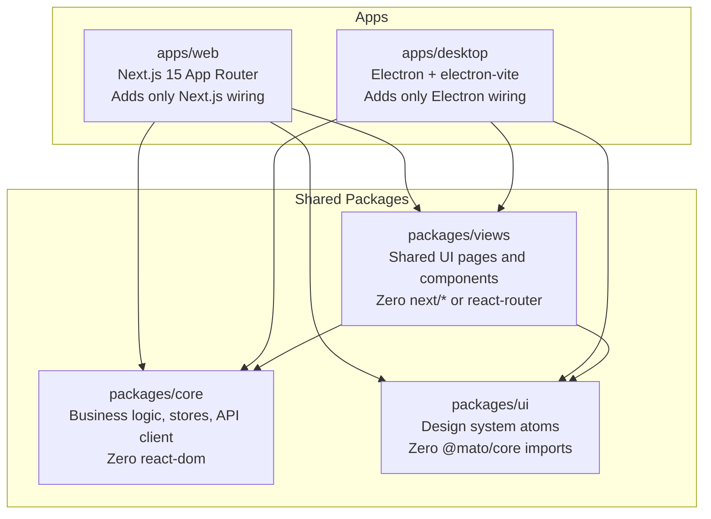
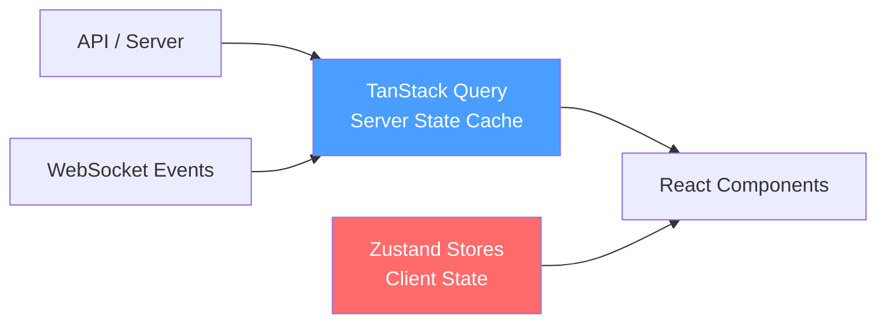
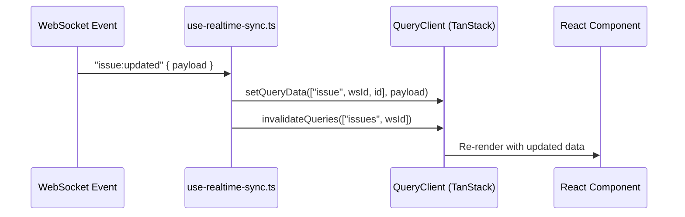

# Frontend Architecture

## Overview: Shared Code, Two Apps



> [!IMPORTANT] The No-Duplication Rule
> If the same logic exists in both the web app and the desktop app, it **must** be extracted to a shared package. Copy-pasting between apps is an architectural violation.

---

## Package Responsibilities

### `packages/core/` — The Brain

Zero React DOM. Zero framework imports. Runs identically in both apps.

| Module | What it contains |
|--------|----------------|
| `api/client.ts` | Fetch-based HTTP client; auto-injects auth and workspace headers |
| `api/ws-client.ts` | WebSocket manager; handles auth, reconnection, event dispatch |
| `api/schema.ts` | `parseWithFallback()` — safe response parsing with Zod + fallback |
| `api/schemas.ts` | Zod schemas for all API response shapes |
| `agents/` | Agent queries, mutations, Zustand store, types |
| `auth/` | Auth store, JWT utils |
| `issues/` | Issue queries, mutations, stores |
| `runtimes/` | Runtime discovery and health |
| `skills/` | Skill queries, mutations |
| `squads/` | Squad management |
| `chat/` | Chat session state, message management |
| `realtime/` | WebSocket connection + event subscription hooks |
| `platform/` | Storage abstraction (localStorage vs. electron-store) |
| `paths/` | Route generation + reserved slugs |
| `permissions/` | Role-based permission checks |
| `i18n/` | Internationalization (en, zh-Hans) |

### `packages/views/` — The Face

All shared React components. Can import from `core/`. **Cannot** import from `next/*` or `react-router-dom`.

```
views/
  agents/         ← Agent management pages
  auth/           ← Login page
  autopilots/     ← Autopilot builder
  chat/           ← Chat window, message input
  dashboard/      ← Usage charts
  issues/         ← Issue list, detail, kanban, forms
  layout/         ← Dashboard shell, sidebar, navigation, DashboardGuard
  projects/       ← Project views
  runtimes/       ← Runtime status, model/skill mgmt
  settings/       ← Workspace settings
  skills/         ← Skill editor and library
  squads/         ← Squad management
  common/         ← Actor avatar, markdown, task transcript
```

### `packages/ui/` — The Atoms

Atomic UI components with zero business logic. Based on shadcn/ui with Base UI primitives (`@base-ui/react`, not Radix). Install new components with `pnpm ui:add <name>` from project root.

> [!IMPORTANT] UI Has Zero Core Imports
> `packages/ui/` has zero imports from `@mato/core`. If a UI component needs business logic, it receives it as props.

---

## State Management: The Strict Split



| What | Where | Examples |
|------|-------|---------|
| Data from the API | **TanStack Query** | Issues, agents, comments, members |
| UI selections, filters | **Zustand** | Current filter, selected issue ID, modal open/closed |
| Drafts, preferences | **Zustand + persist** | Draft comment text, view mode |

> [!CAUTION] Never Duplicate Server Data in Zustand
> If it came from the API, it stays in the Query cache. Copying API data into a Zustand store creates two sources of truth that will drift. This is the most common architecture violation.

### TanStack Query Pattern

```typescript
// packages/core/issues/queries.ts
export function useIssues(wsId: string) {
  return useQuery({
    queryKey: ["issues", wsId],   // workspace-scoped key — switching workspaces auto-shows correct data
    queryFn: () => api.listIssues(wsId),
  })
}

export function useUpdateIssue(wsId: string) {
  return useMutation({
    mutationFn: (data) => api.updateIssue(data),
    onMutate: async (data) => {
      // Optimistic update before request fires
      const previous = queryClient.getQueryData(["issues", wsId])
      queryClient.setQueryData(["issues", wsId], (old) =>
        old.map(i => i.id === data.id ? { ...i, ...data } : i)
      )
      return { previous }
    },
    onError: (_, __, ctx) => queryClient.setQueryData(["issues", wsId], ctx.previous),
    onSettled: () => queryClient.invalidateQueries({ queryKey: ["issues", wsId] })
  })
}
```

### Zustand Pattern

```typescript
// packages/core/issues/stores/filter-store.ts — client state only
const useIssueFilterStore = create<IssueFilterState>()(
  persist(
    (set) => ({
      statusFilter: [],
      setStatusFilter: (statuses) => set({ statusFilter: statuses }),
    }),
    { name: "issue-filters" }
  )
)
```

> [!WARNING] Zustand Selector Stability
> Selectors that return freshly-built objects cause infinite re-renders:
> ```typescript
> // BAD — new object every render
> const data = useStore(s => ({ a: s.a, b: s.b }))
> // GOOD — stable references
> const a = useStore(s => s.a)
> const b = useStore(s => s.b)
> // OR with shallow comparison
> const { a, b } = useStore(s => ({ a: s.a, b: s.b }), shallow)
> ```

---

## Routing Abstraction

Both apps need the same pages but use different routing libraries. The `NavigationAdapter` solves this:

```typescript
// packages/core/navigation/index.ts
interface NavigationAdapter {
  push(path: string): void
  replace(path: string): void
  back(): void
}
```

| App | Implementation | Location |
|-----|---------------|---------|
| Web | `next/navigation` | `apps/web/platform/navigation.tsx` |
| Desktop | `react-router-dom` (in-memory router) | `apps/desktop/src/renderer/src/platform/navigation.tsx` |

Shared components use `useNavigation().push(path)` and `<AppLink href={path}>`. They **never** import from `next/navigation` or `react-router-dom`.

### Web App Route Structure

```
app/
├── layout.tsx                        ← Root layout (fonts, providers)
├── (auth)/
│   ├── login/                        ← Magic-link login
│   ├── onboarding/                   ← Post-signup flow
│   └── workspaces/                   ← Workspace picker / create
├── (landing)/
│   └── page.tsx                      ← Homepage
└── [workspaceSlug]/
    ├── layout.tsx                    ← Auth check, WebSocket connection
    └── (dashboard)/
        ├── layout.tsx                ← Sidebar + header shell
        ├── issues/                   ← Issue board
        ├── issues/[id]/              ← Issue detail
        ├── agents/                   ← Agent list + detail
        ├── skills/                   ← Skill library
        ├── autopilots/               ← Automation builder
        ├── chat/                     ← Chat with agents
        ├── squads/                   ← Squad management
        ├── runtimes/                 ← Runtime status
        ├── inbox/                    ← Notifications
        ├── usage/                    ← Token usage dashboard
        └── settings/                 ← Workspace settings
```

---

## Real-Time Data Flow



> [!NOTE] Events Invalidate Caches — Never Write to Zustand
> `use-realtime-sync.ts` hooks WebSocket events to TanStack Query cache operations only. WebSocket events never write directly to Zustand stores.

---

## API Response Compatibility

> [!CAUTION] Desktop App Compatibility Contract
> The desktop app on a user's machine may be older than the server. A user on v0.2.26 will hit a server on v0.3.x. Response shapes must survive drift. Three incidents already happened from violating this (#2143, #2147, #2192).

Rules:

```typescript
// BAD — bare cast crashes on unexpected shape
const issue = response as Issue

// GOOD — safe parse with fallback
const issue = parseWithFallback(IssueSchema, response, DEFAULT_ISSUE)
// On parse failure: logs warning, returns DEFAULT_ISSUE, never throws

// BAD — optional field assumed present
if (issue.newField.enabled) { ... }

// GOOD — optional chain + explicit boolean check
if (issue.newField?.enabled === true) { ... }

// BAD — enum drift crashes
switch (task.status) {
  case "queued": ...; case "running": ...;
  // Missing: what if server sends a new status value?
}

// GOOD — safe with default branch
switch (task.status) {
  case "queued": ...; case "running": ...;
  default: return <GenericStatus />;  // handles unknown future values
}
```

---

## Desktop App Differences

The desktop app adds only Electron-specific wiring:

| Feature | Web | Desktop |
|---------|-----|---------|
| Auth storage | HttpOnly cookie | electron-store |
| Routing | Next.js App Router (URL bar) | react-router in-memory (no URL bar) |
| New workspace flow | Route `/workspaces/new` | `WindowOverlay` (not a route) |
| Stale workspace | `NoAccessPage` (shareable URL) | Silent tab heal |
| Window drag | N/A | `<DragStrip />` required in full-window views |
| Tabs | Browser tabs | Per-workspace tab groups in Zustand |
| SSR | Yes (Next.js) | No (pure client-side) |

> [!WARNING] DragStrip Required
> Every full-window desktop view must mount `<DragStrip />` from `@mato/views/platform` as the first flex child. Without it, users can't drag the macOS window. Interactive UI inside the top 48px needs `WebkitAppRegion: "no-drag"`.

---

## Key Shared Components

| Component | Location | Purpose |
|-----------|----------|---------|
| `DashboardGuard` | `views/layout/` | Auth + workspace membership check; used by both apps |
| `CoreProvider` | `core/platform/` | Initializes API client, auth, WebSocket, QueryClient |
| `ChatWindow` | `views/chat/components/` | Real-time chat with live transcript of agent execution |
| `TaskTranscript` | `views/common/task-transcript/` | Live + historical agent execution log |
| `ActorAvatar` | `views/common/` | Renders human or agent avatar consistently |
| `AppLink` | (via NavigationAdapter) | Cross-platform navigation link |

---

## Internationalization

Supported locales: **English** (`en`) and **Simplified Chinese** (`zh-Hans`)

The user's language preference is stored server-side (`user.language`) and validated against a hardcoded map in Go (`handler/auth.go → supportedLanguages`). This map must stay in sync with `SUPPORTED_LOCALES` in `packages/core/i18n/types.ts`.

---

## Testing Conventions

| What to test | Where the test lives | Why |
|---|---|---|
| Pure logic (stores, utils) | `packages/core/*.test.ts` | No DOM, fast, no mocking |
| Shared UI components | `packages/views/*.test.tsx` | jsdom, real component testing |
| Next.js-specific wiring | `apps/web/*.test.tsx` | Needs framework mocks |
| Full user flows | `e2e/*.spec.ts` | Real browser + backend |

> [!WARNING] Most Common Test Mistake
> Writing a test for a `packages/views/` component in `apps/web/` and needing to mock `next/navigation`. If the component doesn't import from Next.js, its test shouldn't either — move the test to `packages/views/`.

---

## Related Documents

- [[architecture-overview]] — System overview
- [[data-flow]] — How data flows from server to UI
- [[backend/02-websocket-realtime]] — WebSocket event system
- [[glossary]] — NavigationAdapter, TanStack Query, Zustand, DashboardGuard definitions
