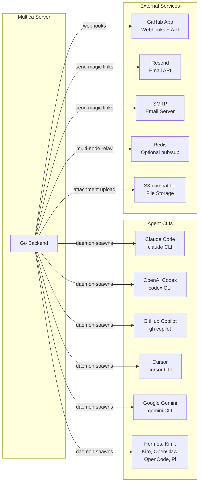
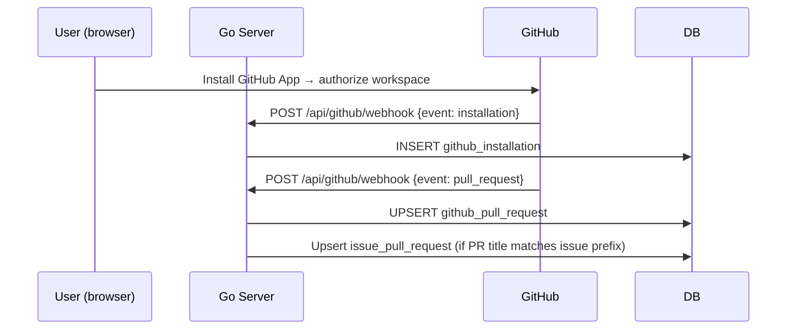

# External Integrations

## Integration Map



---

## Agent CLI Providers

### Overview

Multica supports **11 agent CLI providers**. All are implemented in `server/pkg/agent/` and conform to a single Go interface. The daemon spawns the appropriate CLI as a subprocess, streams its output, and reports results back to the server.

| Provider | File | CLI Binary | Notes |
|----------|------|-----------|-------|
| Claude Code | `claude.go` | `claude` | Anthropic's coding agent; primary/most tested |
| OpenAI Codex | `codex.go` | `codex` | OpenAI's CLI coding tool |
| GitHub Copilot | `copilot.go` | `gh copilot` | Uses GitHub CLI extension |
| Cursor | `cursor.go` | `cursor` | Agentic IDE; most complex invocation (platform-specific) |
| Google Gemini | `gemini.go` | `gemini` | Google Gemini CLI |
| Hermes ACP | `hermes.go` | `hermes` | Uses Agent Communication Protocol; ignores SystemPrompt |
| Kimi | `kimi.go` | `kimi` | Moonshot AI CLI |
| Kiro | `kiro.go` | `kiro` | Amazon Kiro CLI |
| OpenClaw | `openclaw.go` | `openclaw` | |
| OpenCode | `opencode.go` | `opencode` | |
| Pi | `pi.go` | `pi` | Inflection AI CLI |

### The Backend Interface

Every agent provider implements this interface:

```go
// server/pkg/agent/agent.go
type Backend interface {
    Execute(ctx context.Context, prompt string, opts ExecOptions) (*Session, error)
}

type ExecOptions struct {
    Cwd                       string
    Model                     string
    SystemPrompt              string          // Hermes ACP ignores this
    MaxTurns                  int
    Timeout                   time.Duration
    SemanticInactivityTimeout time.Duration
    ResumeSessionID           string          // Empty = fresh start
    ExtraArgs                 []string        // Daemon-wide defaults (claude + codex only)
    CustomArgs                []string        // Per-agent CLI overrides
    McpConfig                 json.RawMessage // Written to temp file → --mcp-config
}

type Session struct {
    Messages <-chan Message  // Closed when agent finishes
    Result   <-chan Result   // Exactly one value, then closes
}
```

### Message Types

All providers emit a unified stream of `Message` values:

| Type | Description |
|------|-------------|
| `text` | Prose output from the agent |
| `thinking` | Agent's internal reasoning (Claude extended thinking) |
| `tool-use` | Agent invoked a tool (name + input) |
| `tool-result` | Tool returned output |
| `status` | Status update; `SessionID` field populated here for early pinning |
| `error` | Agent reported an error |
| `log` | Debug/informational log |

### How Claude Code Is Invoked

Claude is the most battle-tested provider. The daemon calls:

```bash
claude \
  --output-format stream-json \
  --model <model> \
  --max-turns <n> \
  --print \
  [--resume <session-id>] \
  [--system-prompt <text>] \
  [--mcp-config <path>] \
  [--timeout <seconds>] \
  [extra_args...] \
  [custom_args...]
```

- **`--output-format stream-json`** — emits one JSON object per line; each is parsed into a `Message`
- **Prompt is piped via stdin** — the task description plus skill content references
- **`--mcp-config`** — if `agent.mcp_config` is non-null, the JSON is written to a temp file and passed here
- **Stderr** is captured into a bounded tail buffer — the last ~16KB is included in the failure error message if the CLI crashes, which makes diagnosing V8/Bun panics possible

### How Cursor Is Invoked

Cursor has the most complex invocation (`cursor.go` + `cursor_invocation.go` + platform-specific files):

- The `cursor` binary behaves differently on macOS vs. Windows
- `cursor_invocation_windows.go` uses different argument ordering
- Requires no `--output-format` flag — output parsing is different from Claude's JSON stream

### MCP Config Per Agent

Each agent can have an `mcp_config` JSONB column containing MCP server definitions. When a task runs:

1. The `mcp_config` JSON is written to a temp file (in the task work directory)
2. `--mcp-config <path>` is appended to the CLI invocation
3. The temp file is cleaned up after the CLI exits

This lets each agent have a controlled, isolated set of MCP servers rather than inheriting from whatever the daemon operator has configured.

---

## Adding a New Agent Provider

> [!TIP] Integration Contract
> Adding a new provider requires only three steps. The daemon auto-detects it by the presence of the CLI binary.

### Step 1: Implement the Backend

Create `server/pkg/agent/<name>.go`:

```go
package agent

type myProviderBackend struct {
    cfg Config
}

func (b *myProviderBackend) Execute(ctx context.Context, prompt string, opts ExecOptions) (*Session, error) {
    // 1. Look up the CLI binary
    execPath := b.cfg.ExecutablePath
    if execPath == "" {
        execPath = "myprovider"
    }
    if _, err := exec.LookPath(execPath); err != nil {
        return nil, fmt.Errorf("myprovider not found: %w", err)
    }
    
    // 2. Build args from opts
    args := []string{"run", "--json-output"}
    if opts.Model != "" {
        args = append(args, "--model", opts.Model)
    }
    // ... handle ResumeSessionID, MaxTurns, etc.
    args = append(args, opts.ExtraArgs...)
    args = append(args, opts.CustomArgs...)
    
    // 3. Spawn process, pipe stdin/stdout
    // 4. Return Session with Messages + Result channels
    // 5. Parse output lines → Message structs in a goroutine
    
    return session, nil
}
```

### Step 2: Register in the Provider Map

Add to `server/pkg/agent/models.go` (or the equivalent registry):

```go
var providerRegistry = map[string]func(Config) Backend{
    "claude":    func(c Config) Backend { return &claudeBackend{cfg: c} },
    "myprovider": func(c Config) Backend { return &myProviderBackend{cfg: c} },
    // ...
}
```

### Step 3: Add CLI Detection in the Daemon

In `server/internal/daemon/daemon.go`, the daemon scans for installed CLIs at startup:

```go
var knownProviders = []string{
    "claude", "codex", "cursor", "gemini", "hermes",
    "kimi", "kiro", "openclaw", "opencode", "pi",
    "myprovider",  // Add here
}
```

The daemon calls `exec.LookPath` for each provider. Found ones get registered as `agent_runtime` rows.

> [!IMPORTANT] No Server Restart Needed
> The daemon detects providers at startup and registers them. Adding a new provider to the server code and deploying means any daemon that restarts will detect the new CLI if it's installed.

---

## GitHub Integration

### What It Does

- Connects a GitHub App to a workspace
- Receives webhook events (PR opened, merged, status checks)
- Mirrors PR state into the `github_pull_request` table
- Links issues to PRs via `issue_pull_request`

### Connection Flow



### PR Auto-Linking

When a PR title contains an issue reference (e.g., `"Fix MUL-123: auth bug"`), the server:
1. Parses the workspace's `issue_prefix` from the PR title
2. Looks up the matching issue by `PREFIX-N` format
3. Inserts an `issue_pull_request` row
4. Updates the issue UI to show the PR

### Environment Variables

| Variable | Purpose |
|----------|---------|
| `GITHUB_APP_ID` | GitHub App ID |
| `GITHUB_APP_PRIVATE_KEY` | PEM-formatted private key |
| `GITHUB_APP_WEBHOOK_SECRET` | Webhook signature validation |
| `GITHUB_APP_CLIENT_ID` | OAuth for user authorization |
| `GITHUB_APP_CLIENT_SECRET` | OAuth secret |

---

## Email

Magic-link auth requires sending 6-digit verification codes. Two providers are supported; the server tries them in order.

### Resend (Primary)

Set `RESEND_API_KEY`. The server calls the Resend API to send transactional email. Recommended for production.

### SMTP (Fallback)

Set `SMTP_HOST`, `SMTP_PORT`, `SMTP_USERNAME`, `SMTP_PASSWORD`, `SMTP_FROM`. Used when Resend key is not set.

### Development Fallback

When **neither** Resend nor SMTP is configured, the verification code is printed to the server log:

```
INFO verification code for dev  email=user@example.com code=123456
```

> [!CAUTION] Development Only
> The log fallback is rejected in `APP_ENV=production`. If neither email provider is configured on a production instance, magic-link login silently fails. Always configure at least one provider before deploying.

---

## Redis

Redis is optional but enables two important features:

### 1. Multi-Node WebSocket Relay

Without Redis, WebSocket broadcasts work only on single-node deployments. Events published on one node don't reach clients connected to another node.

With `REDIS_URL` set, the server uses Redis Streams as a relay layer. Three relay modes (set via `REDIS_RELAY_MODE`):

| Mode | Behavior |
|------|---------|
| `sharded` | Default. Each workspace has its own stream. Best performance at scale. |
| `legacy` | Single global stream. Used by older deployments. |
| `dual` | Writes to both, reads from legacy. Migration tool for switching modes. |

### 2. Cross-Node State Stores

Without Redis, the following stores are **in-memory only** and data is lost on server restart:

- **PAT cache** — positive PAT lookups; auth still works but every request hits the DB until TTL
- **Local skill lists** — skills reported by the daemon; disappear on restart
- **Local skill import requests** — pending imports; disappear on restart
- **DaemonHub connections** — WebSocket connections to daemon processes

> [!WARNING] Data Loss Without Redis
> Users see their reported local skills disappear after a server restart when Redis is not configured. This surprises self-hosters who don't expect in-memory state. Always document `REDIS_URL` as recommended even for single-node setups.

---

## File Storage (Attachments)

Attachments (uploaded files on issues/comments) require external object storage. The server generates a presigned upload URL; the client uploads directly to storage.

> [!NOTE] Not Fully Documented in Codebase
> The attachment upload URL generation is implemented in the handler layer but the specific storage provider integration (S3 vs. R2 vs. other) is not explicitly documented in the public codebase. Check `server/internal/handler/attachment.go` for the implementation.

---

## MCP (Model Context Protocol)

MCP servers extend what an agent can do — they provide additional tools the agent can call during task execution (database access, API calls, file operations, etc.).

Multica integrates MCP at the **per-agent level**, not at the system level:

1. A workspace admin configures an MCP config JSON blob for a specific agent
2. The JSON is stored in `agent.mcp_config`
3. At task execution time, the daemon writes this JSON to a temp file
4. The agent CLI receives `--mcp-config <path>` and uses those servers

This means each agent has its own isolated set of MCP servers. An agent can have powerful tools (database MCP server) while another has none.

> [!TIP] MCP Config Format
> The MCP config JSON follows the Claude Code MCP specification format. Refer to the Claude Code documentation for the `--mcp-config` file structure.

---

## Related Documents

- [[backend/03-agent-lifecycle]] — Full agent execution lifecycle
- [[backend/06-skill-knowledge-system]] — How skills are delivered to agents
- [[architecture-overview]] — System overview showing all components
- [[what-to-change-for-saas]] — Production configuration requirements
- [[glossary]] — Key terms: daemon, runtime, provider, MCP
